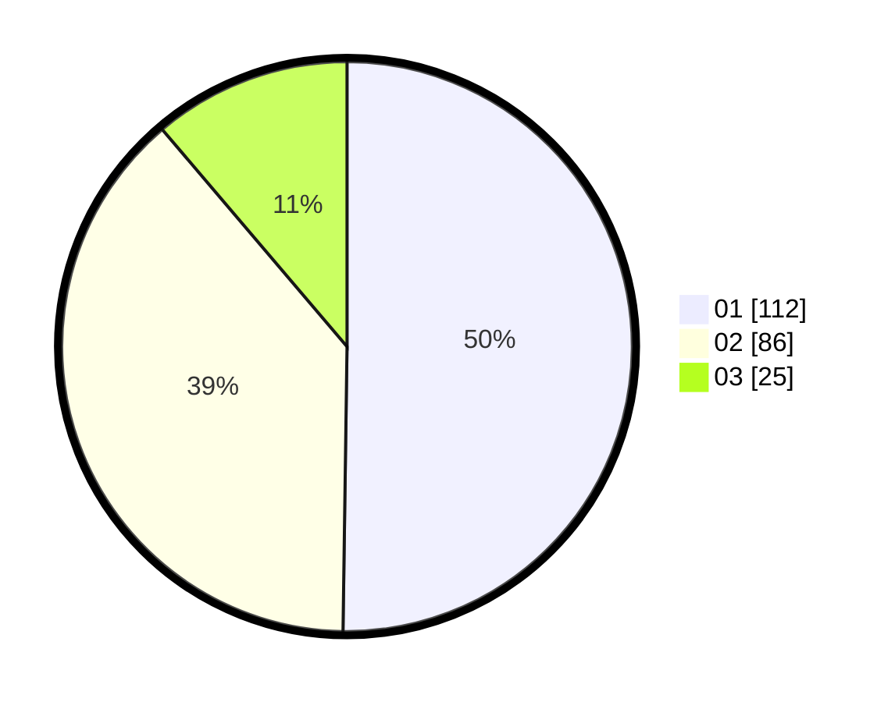

# Hasil

Hasil perolehan suara paslon dapat dilihat pada file paslon-01.txt, paslon-02.txt, dan paslon-03.txt.

Jika tidak ada, artinya data tersebut belum ada pada SIREKAP.

## Perolehan Suara

 * Paslon 01: **112**.
 * Paslon 02: **86**.
 * Paslon 03: **25**.

## Foto C Plano

https://sirekap-obj-formc.kpu.go.id/55d3/pemilu/ppwp/31/75/08/10/05/3175081005059-20240215-001803--4d0a3f92-2456-4397-9e05-d4f04705c265.jpg

https://sirekap-obj-formc.kpu.go.id/55d3/pemilu/ppwp/31/75/08/10/05/3175081005059-20240215-002125--98f55416-b928-4dee-a40e-6ba18f7c0280.jpg

https://sirekap-obj-formc.kpu.go.id/55d3/pemilu/ppwp/31/75/08/10/05/3175081005059-20240215-002213--d4de6da8-2b9f-49d1-8568-d0af8b03a3a7.jpg
