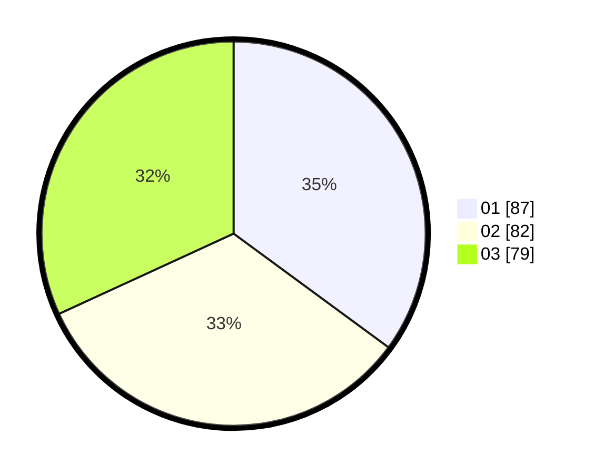

# Hasil

Hasil perolehan suara paslon dapat dilihat pada file paslon-01.txt, paslon-02.txt, dan paslon-03.txt.

Jika tidak ada, artinya data tersebut belum ada pada SIREKAP.

## Perolehan Suara

 * Paslon 01: **87**.
 * Paslon 02: **82**.
 * Paslon 03: **79**.

## Foto C Plano

https://sirekap-obj-formc.kpu.go.id/fbb0/pemilu/ppwp/31/75/08/10/05/3175081005060-20240216-143002--e8c1cc3f-db69-4ba9-95a0-dc4e744ed5dc.jpg

https://sirekap-obj-formc.kpu.go.id/fbb0/pemilu/ppwp/31/75/08/10/05/3175081005060-20240216-143003--50d9a13d-932d-4ff2-a9c2-855703a39738.jpg

https://sirekap-obj-formc.kpu.go.id/fbb0/pemilu/ppwp/31/75/08/10/05/3175081005060-20240216-143002--9e0f33c3-9088-47c1-9116-6437c4b7039a.jpg

## DATA PEMILIH TETAP

Jumlah pemilih dalam DPT: **0**.
 * L: **0**.
 * P: **0**.

## DATA PENGGUNA HAK PILIH

Jumlah pengguna hak pilih dalam DPT: **0**.
 * L: **0**.
 * P: **0**.

Jumlah pengguna hak pilih dalam DPTb: **0**.
 * L: **0**.
 * P: **0**.

Jumlah pengguna hak pilih dalam DPK: **0**.
 * L: **0**.
 * P: **0**.

Jumlah pengguna hak pilih: **0**.
 * L: **0**.
 * P: **0**.

## JUMLAH SUARA SAH DAN TIDAK SAH

JUMLAH SELURUH SUARA SAH: **248**.

JUMLAH SUARA TIDAK SAH: **5**.

JUMLAH SELURUH SUARA SAH DAN SUARA TIDAK SAH: **253**.
