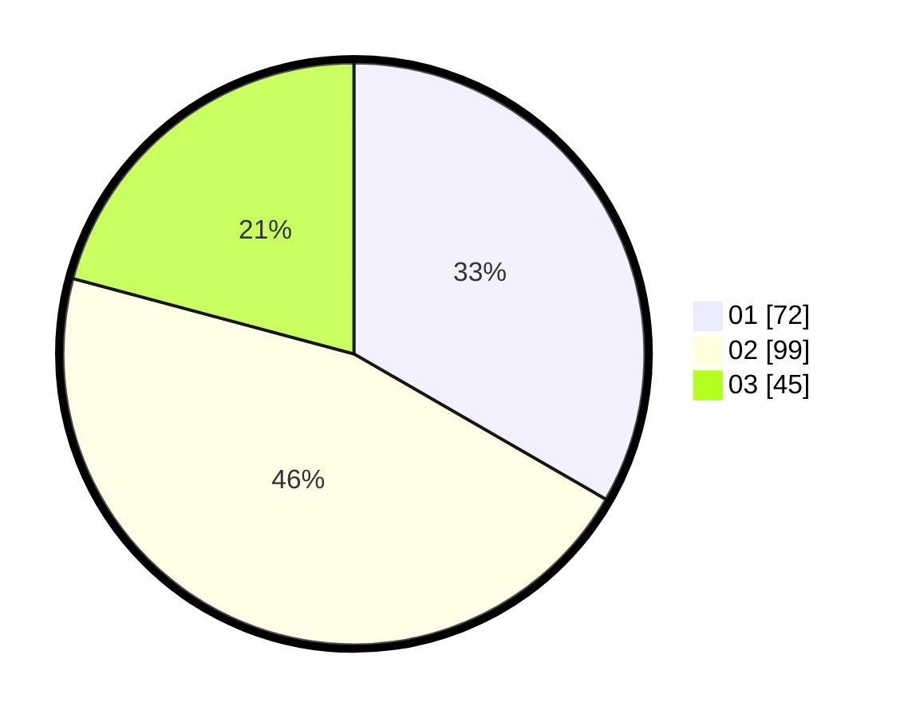

# Hasil

Hasil perolehan suara paslon dapat dilihat pada file paslon-01.txt, paslon-02.txt, dan paslon-03.txt.

Jika tidak ada, artinya data tersebut belum ada pada SIREKAP.

## Perolehan Suara

 * Paslon 01: **72**.
 * Paslon 02: **99**.
 * Paslon 03: **45**.

## Foto C Plano

https://sirekap-obj-formc.kpu.go.id/4899/pemilu/ppwp/31/75/08/10/05/3175081005062-20240216-094717--e838bf28-d829-4a40-b397-883c4aa45392.jpg

https://sirekap-obj-formc.kpu.go.id/4899/pemilu/ppwp/31/75/08/10/05/3175081005062-20240216-091941--d57aad49-edf3-42b0-a0c1-a50b3dbe0ba7.jpg

https://sirekap-obj-formc.kpu.go.id/4899/pemilu/ppwp/31/75/08/10/05/3175081005062-20240216-102538--30e005f4-aa6f-4b87-a526-1b02d78b302c.jpg

## DATA PEMILIH TETAP

Jumlah pemilih dalam DPT: **264**.
 * L: **121**.
 * P: **143**.

## DATA PENGGUNA HAK PILIH

Jumlah pengguna hak pilih dalam DPT: **218**.
 * L: **99**.
 * P: **119**.

Jumlah pengguna hak pilih dalam DPTb: **1**.
 * L: **0**.
 * P: **1**.

Jumlah pengguna hak pilih dalam DPK: **2**.
 * L: **1**.
 * P: **1**.

Jumlah pengguna hak pilih: **221**.
 * L: **100**.
 * P: **121**.

## JUMLAH SUARA SAH DAN TIDAK SAH

JUMLAH SELURUH SUARA SAH: **216**.

JUMLAH SUARA TIDAK SAH: **5**.

JUMLAH SELURUH SUARA SAH DAN SUARA TIDAK SAH: **221**.
