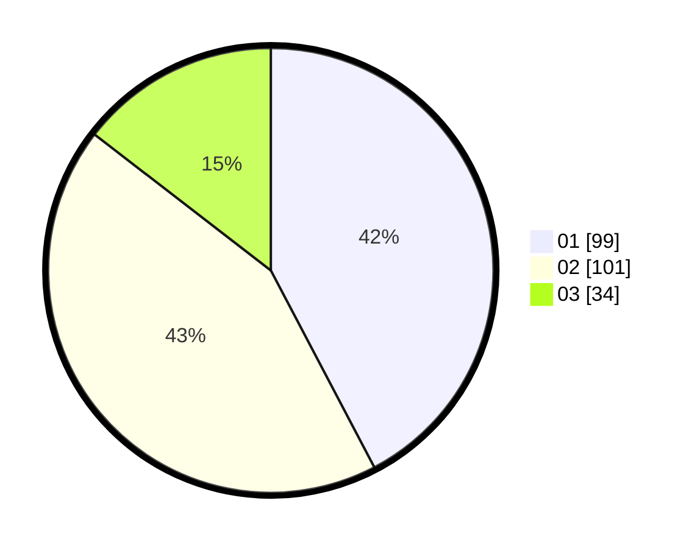

# Hasil

Hasil perolehan suara paslon dapat dilihat pada file paslon-01.txt, paslon-02.txt, dan paslon-03.txt.

Jika tidak ada, artinya data tersebut belum ada pada SIREKAP.

## Perolehan Suara

 * Paslon 01: **99**.
 * Paslon 02: **101**.
 * Paslon 03: **34**.

## Foto C Plano

https://sirekap-obj-formc.kpu.go.id/25ad/pemilu/ppwp/31/75/08/10/05/3175081005071-20240216-061741--658d780e-e6b9-46c2-b2e6-686dfaa49045.jpg

https://sirekap-obj-formc.kpu.go.id/25ad/pemilu/ppwp/31/75/08/10/05/3175081005071-20240215-203359--26bca286-777a-486a-a595-a2304f522a51.jpg

https://sirekap-obj-formc.kpu.go.id/25ad/pemilu/ppwp/31/75/08/10/05/3175081005071-20240214-215350--8f88ae19-b424-4f95-9c15-0b1c756247b4.jpg

## DATA PEMILIH TETAP

Jumlah pemilih dalam DPT: **291**.
 * L: **142**.
 * P: **149**.

## DATA PENGGUNA HAK PILIH

Jumlah pengguna hak pilih dalam DPT: **241**.
 * L: **115**.
 * P: **126**.

Jumlah pengguna hak pilih dalam DPTb: **0**.
 * L: **0**.
 * P: **0**.

Jumlah pengguna hak pilih dalam DPK: **0**.
 * L: **0**.
 * P: **0**.

Jumlah pengguna hak pilih: **241**.
 * L: **115**.
 * P: **126**.

## JUMLAH SUARA SAH DAN TIDAK SAH

JUMLAH SELURUH SUARA SAH: **234**.

JUMLAH SUARA TIDAK SAH: **7**.

JUMLAH SELURUH SUARA SAH DAN SUARA TIDAK SAH: **241**.
