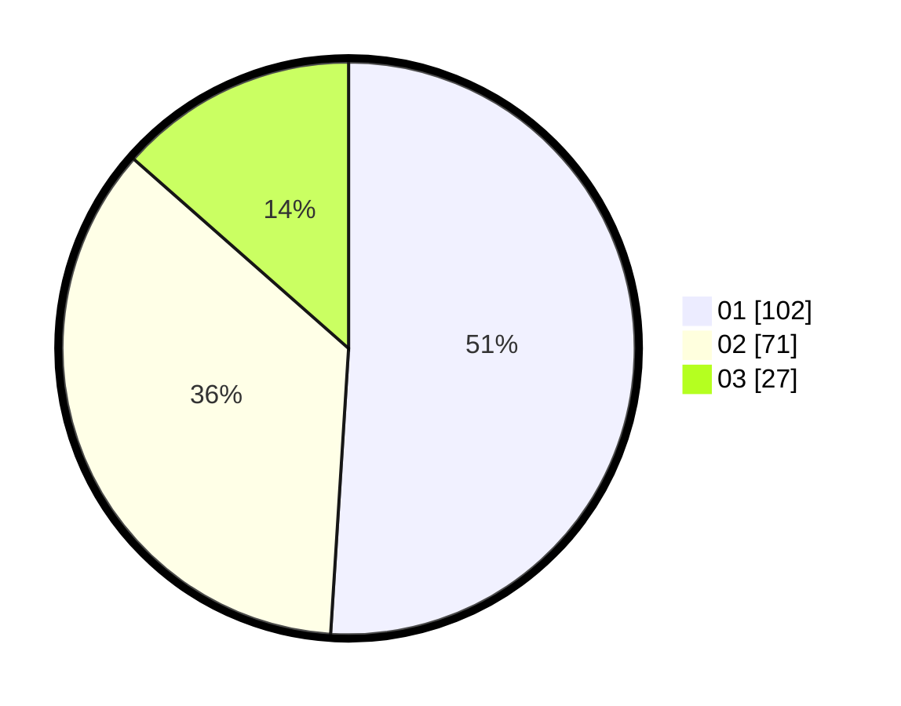

# Hasil

Hasil perolehan suara paslon dapat dilihat pada file paslon-01.txt, paslon-02.txt, dan paslon-03.txt.

Jika tidak ada, artinya data tersebut belum ada pada SIREKAP.

## Perolehan Suara

 * Paslon 01: **102**.
 * Paslon 02: **71**.
 * Paslon 03: **27**.

## Foto C Plano

https://sirekap-obj-formc.kpu.go.id/db93/pemilu/ppwp/31/75/08/10/05/3175081005075-20240215-024142--adfffe36-2fe0-4def-a1ea-a90913d4d2e5.jpg

https://sirekap-obj-formc.kpu.go.id/db93/pemilu/ppwp/31/75/08/10/05/3175081005075-20240215-024154--862ae84d-706b-498a-aac2-1f42641e62b0.jpg

https://sirekap-obj-formc.kpu.go.id/db93/pemilu/ppwp/31/75/08/10/05/3175081005075-20240215-024204--548740b9-bcf1-4223-954e-74f6a5623555.jpg
