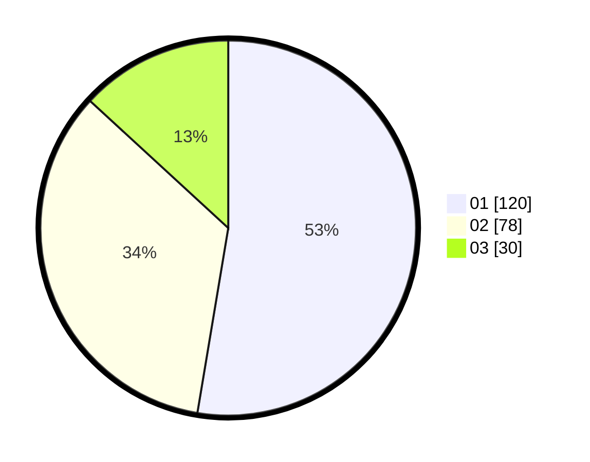

# Hasil

Hasil perolehan suara paslon dapat dilihat pada file paslon-01.txt, paslon-02.txt, dan paslon-03.txt.

Jika tidak ada, artinya data tersebut belum ada pada SIREKAP.

## Perolehan Suara

 * Paslon 01: **120**.
 * Paslon 02: **78**.
 * Paslon 03: **30**.

## Foto C Plano

https://sirekap-obj-formc.kpu.go.id/b551/pemilu/ppwp/31/75/08/10/05/3175081005076-20240214-224646--5487b913-2d0e-45f6-be2c-8e5ffb415fd9.jpg

https://sirekap-obj-formc.kpu.go.id/b551/pemilu/ppwp/31/75/08/10/05/3175081005076-20240214-224800--970825ed-6996-4248-993c-90229e6c1497.jpg

https://sirekap-obj-formc.kpu.go.id/b551/pemilu/ppwp/31/75/08/10/05/3175081005076-20240214-224921--0c5b22ad-51d9-4893-8855-09beee8ff0b7.jpg

## DATA PEMILIH TETAP

Jumlah pemilih dalam DPT: **269**.
 * L: **138**.
 * P: **131**.

## DATA PENGGUNA HAK PILIH

Jumlah pengguna hak pilih dalam DPT: **225**.
 * L: **111**.
 * P: **114**.

Jumlah pengguna hak pilih dalam DPTb: **5**.
 * L: **2**.
 * P: **3**.

Jumlah pengguna hak pilih dalam DPK: **1**.
 * L: **1**.
 * P: **0**.

Jumlah pengguna hak pilih: **231**.
 * L: **114**.
 * P: **117**.

## JUMLAH SUARA SAH DAN TIDAK SAH

JUMLAH SELURUH SUARA SAH: **228**.

JUMLAH SUARA TIDAK SAH: **3**.

JUMLAH SELURUH SUARA SAH DAN SUARA TIDAK SAH: **231**.
