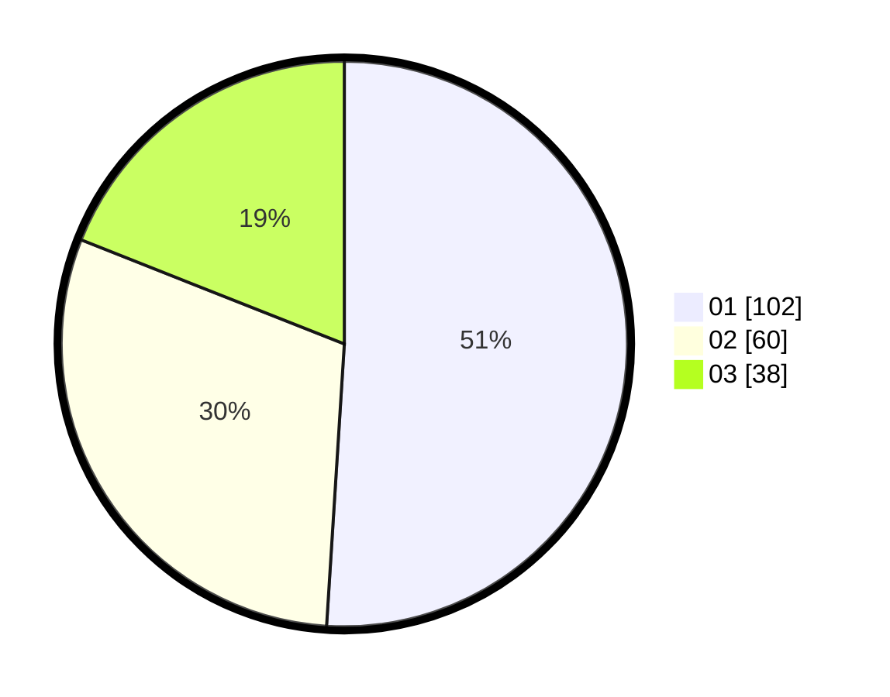

# Hasil

Hasil perolehan suara paslon dapat dilihat pada file paslon-01.txt, paslon-02.txt, dan paslon-03.txt.

Jika tidak ada, artinya data tersebut belum ada pada SIREKAP.

## Perolehan Suara

 * Paslon 01: **102**.
 * Paslon 02: **60**.
 * Paslon 03: **38**.

## Foto C Plano

https://sirekap-obj-formc.kpu.go.id/e0d6/pemilu/ppwp/31/75/08/10/05/3175081005081-20240215-044546--65cd5543-c0c9-4763-8886-c2f2af3a33a3.jpg

https://sirekap-obj-formc.kpu.go.id/e0d6/pemilu/ppwp/31/75/08/10/05/3175081005081-20240215-044557--a19b1b01-1877-4cc5-8c9d-3328fb1bdbca.jpg

https://sirekap-obj-formc.kpu.go.id/e0d6/pemilu/ppwp/31/75/08/10/05/3175081005081-20240215-044601--0e788074-d972-4248-a27c-4f4b52f4e471.jpg

## DATA PEMILIH TETAP

Jumlah pemilih dalam DPT: **265**.
 * L: **124**.
 * P: **141**.

## DATA PENGGUNA HAK PILIH

Jumlah pengguna hak pilih dalam DPT: **198**.
 * L: **92**.
 * P: **106**.

Jumlah pengguna hak pilih dalam DPTb: **1**.
 * L: **1**.
 * P: **0**.

Jumlah pengguna hak pilih dalam DPK: **3**.
 * L: **1**.
 * P: **2**.

Jumlah pengguna hak pilih: **202**.
 * L: **94**.
 * P: **108**.

## JUMLAH SUARA SAH DAN TIDAK SAH

JUMLAH SELURUH SUARA SAH: **200**.

JUMLAH SUARA TIDAK SAH: **2**.

JUMLAH SELURUH SUARA SAH DAN SUARA TIDAK SAH: **202**.
