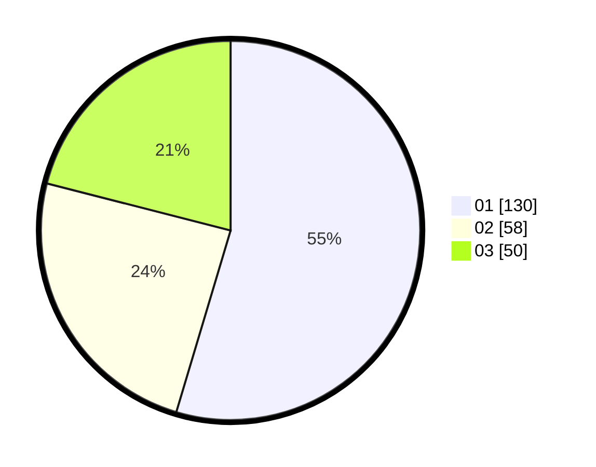

# Hasil

Hasil perolehan suara paslon dapat dilihat pada file paslon-01.txt, paslon-02.txt, dan paslon-03.txt.

Jika tidak ada, artinya data tersebut belum ada pada SIREKAP.

## Perolehan Suara

 * Paslon 01: **130**.
 * Paslon 02: **58**.
 * Paslon 03: **50**.

## Foto C Plano

https://sirekap-obj-formc.kpu.go.id/9322/pemilu/ppwp/31/75/08/10/05/3175081005084-20240214-221839--cf368954-3050-456c-a5f9-ceb1a7ae0249.jpg

https://sirekap-obj-formc.kpu.go.id/9322/pemilu/ppwp/31/75/08/10/05/3175081005084-20240214-222005--27fc0cbf-4eb3-4a99-be53-e4b23e239ab9.jpg

https://sirekap-obj-formc.kpu.go.id/9322/pemilu/ppwp/31/75/08/10/05/3175081005084-20240214-222139--5fae2c5f-f2e9-4acc-a616-3347214fe7c5.jpg

## DATA PEMILIH TETAP

Jumlah pemilih dalam DPT: **274**.
 * L: **136**.
 * P: **138**.

## DATA PENGGUNA HAK PILIH

Jumlah pengguna hak pilih dalam DPT: **234**.
 * L: **112**.
 * P: **122**.

Jumlah pengguna hak pilih dalam DPTb: **5**.
 * L: **3**.
 * P: **2**.

Jumlah pengguna hak pilih dalam DPK: **0**.
 * L: **0**.
 * P: **0**.

Jumlah pengguna hak pilih: **239**.
 * L: **115**.
 * P: **124**.

## JUMLAH SUARA SAH DAN TIDAK SAH

JUMLAH SELURUH SUARA SAH: **238**.

JUMLAH SUARA TIDAK SAH: **1**.

JUMLAH SELURUH SUARA SAH DAN SUARA TIDAK SAH: **239**.
