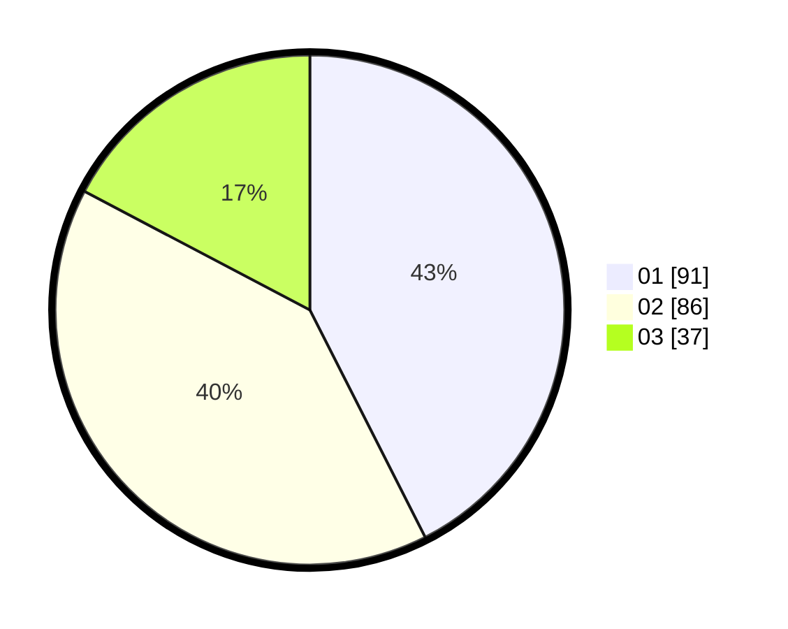

# Hasil

Hasil perolehan suara paslon dapat dilihat pada file paslon-01.txt, paslon-02.txt, dan paslon-03.txt.

Jika tidak ada, artinya data tersebut belum ada pada SIREKAP.

## Perolehan Suara

 * Paslon 01: **91**.
 * Paslon 02: **86**.
 * Paslon 03: **37**.

## Foto C Plano

https://sirekap-obj-formc.kpu.go.id/e611/pemilu/ppwp/31/75/08/10/05/3175081005090-20240214-185335--8b3b2804-37e6-483a-b608-6db6db079d9d.jpg

https://sirekap-obj-formc.kpu.go.id/e611/pemilu/ppwp/31/75/08/10/05/3175081005090-20240214-185350--8ae7db52-da85-49c9-83bc-b3d94abad7bc.jpg

https://sirekap-obj-formc.kpu.go.id/e611/pemilu/ppwp/31/75/08/10/05/3175081005090-20240214-185359--f088deb9-79e1-438e-b713-e3f53a77814b.jpg

## DATA PEMILIH TETAP

Jumlah pemilih dalam DPT: **278**.
 * L: **134**.
 * P: **144**.

## DATA PENGGUNA HAK PILIH

Jumlah pengguna hak pilih dalam DPT: **209**.
 * L: **94**.
 * P: **115**.

Jumlah pengguna hak pilih dalam DPTb: **5**.
 * L: **2**.
 * P: **3**.

Jumlah pengguna hak pilih dalam DPK: **2**.
 * L: **1**.
 * P: **1**.

Jumlah pengguna hak pilih: **216**.
 * L: **97**.
 * P: **119**.

## JUMLAH SUARA SAH DAN TIDAK SAH

JUMLAH SELURUH SUARA SAH: **214**.

JUMLAH SUARA TIDAK SAH: **2**.

JUMLAH SELURUH SUARA SAH DAN SUARA TIDAK SAH: **216**.
