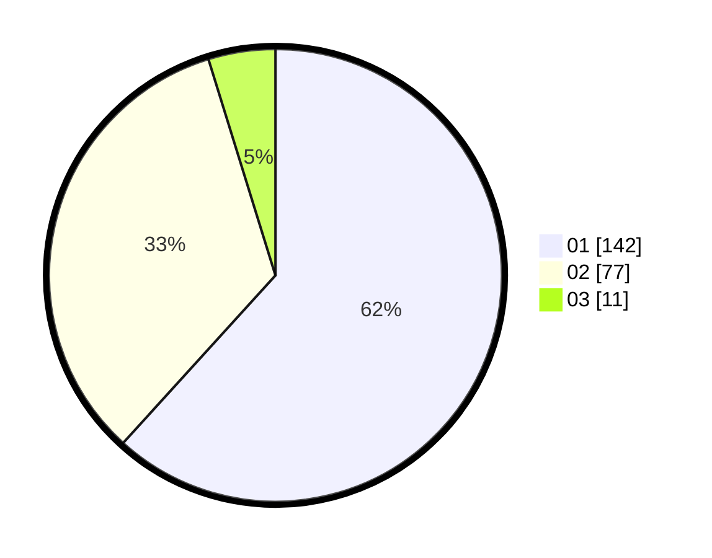

# Hasil

Hasil perolehan suara paslon dapat dilihat pada file paslon-01.txt, paslon-02.txt, dan paslon-03.txt.

Jika tidak ada, artinya data tersebut belum ada pada SIREKAP.

## Perolehan Suara

 * Paslon 01: **142**.
 * Paslon 02: **77**.
 * Paslon 03: **11**.

## Foto C Plano

https://sirekap-obj-formc.kpu.go.id/3dc4/pemilu/ppwp/31/75/08/10/05/3175081005095-20240215-215751--8aec4dbd-cce7-479d-9167-145bddb3b662.jpg

https://sirekap-obj-formc.kpu.go.id/3dc4/pemilu/ppwp/31/75/08/10/05/3175081005095-20240215-215754--2be926f1-ffe9-42fa-b00e-f69eb75fca9f.jpg

https://sirekap-obj-formc.kpu.go.id/3dc4/pemilu/ppwp/31/75/08/10/05/3175081005095-20240215-215752--28d459ee-2b65-4b91-9f41-38c03d26866d.jpg

## DATA PEMILIH TETAP

Jumlah pemilih dalam DPT: **267**.
 * L: **125**.
 * P: **142**.

## DATA PENGGUNA HAK PILIH

Jumlah pengguna hak pilih dalam DPT: **229**.
 * L: **107**.
 * P: **122**.

Jumlah pengguna hak pilih dalam DPTb: **1**.
 * L: **0**.
 * P: **1**.

Jumlah pengguna hak pilih dalam DPK: **2**.
 * L: **1**.
 * P: **1**.

Jumlah pengguna hak pilih: **232**.
 * L: **108**.
 * P: **124**.

## JUMLAH SUARA SAH DAN TIDAK SAH

JUMLAH SELURUH SUARA SAH: **230**.

JUMLAH SUARA TIDAK SAH: **2**.

JUMLAH SELURUH SUARA SAH DAN SUARA TIDAK SAH: **232**.
