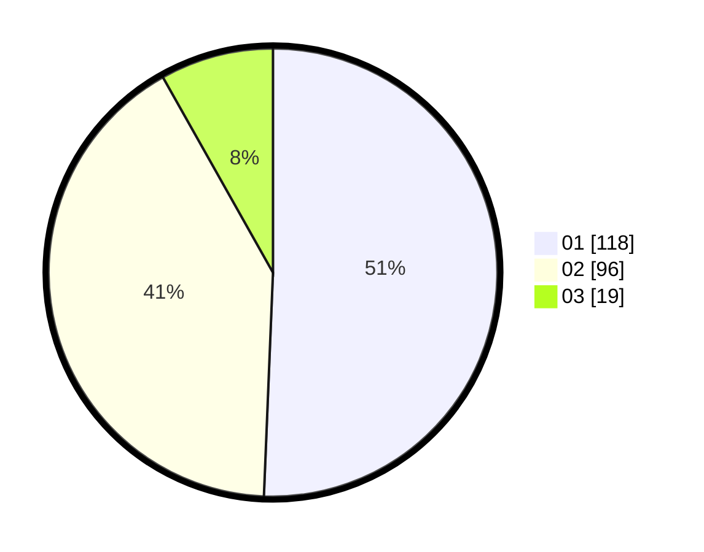

# Hasil

Hasil perolehan suara paslon dapat dilihat pada file paslon-01.txt, paslon-02.txt, dan paslon-03.txt.

Jika tidak ada, artinya data tersebut belum ada pada SIREKAP.

## Perolehan Suara

 * Paslon 01: **118**.
 * Paslon 02: **96**.
 * Paslon 03: **19**.

## Foto C Plano

https://sirekap-obj-formc.kpu.go.id/881f/pemilu/ppwp/31/75/08/10/05/3175081005098-20240215-172757--ad2cfd4b-0a62-408f-ae1e-93941570c225.jpg

https://sirekap-obj-formc.kpu.go.id/881f/pemilu/ppwp/31/75/08/10/05/3175081005098-20240215-172821--2539daaf-356b-4816-af70-7bfb3d5956bc.jpg

https://sirekap-obj-formc.kpu.go.id/881f/pemilu/ppwp/31/75/08/10/05/3175081005098-20240215-172808--fcbe83f1-8794-49ca-87fb-885658b44ce4.jpg

## DATA PEMILIH TETAP

Jumlah pemilih dalam DPT: **283**.
 * L: **143**.
 * P: **140**.

## DATA PENGGUNA HAK PILIH

Jumlah pengguna hak pilih dalam DPT: **227**.
 * L: **114**.
 * P: **113**.

Jumlah pengguna hak pilih dalam DPTb: **7**.
 * L: **2**.
 * P: **5**.

Jumlah pengguna hak pilih dalam DPK: **0**.
 * L: **0**.
 * P: **0**.

Jumlah pengguna hak pilih: **234**.
 * L: **116**.
 * P: **118**.

## JUMLAH SUARA SAH DAN TIDAK SAH

JUMLAH SELURUH SUARA SAH: **233**.

JUMLAH SUARA TIDAK SAH: **1**.

JUMLAH SELURUH SUARA SAH DAN SUARA TIDAK SAH: **234**.
