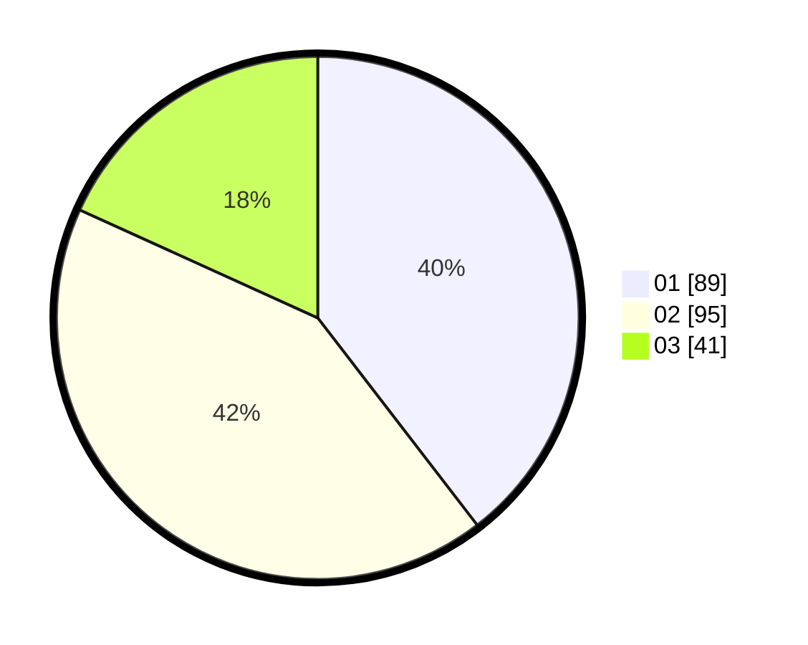

# Hasil

Hasil perolehan suara paslon dapat dilihat pada file paslon-01.txt, paslon-02.txt, dan paslon-03.txt.

Jika tidak ada, artinya data tersebut belum ada pada SIREKAP.

## Perolehan Suara

 * Paslon 01: **89**.
 * Paslon 02: **95**.
 * Paslon 03: **41**.

## Foto C Plano

https://sirekap-obj-formc.kpu.go.id/2b23/pemilu/ppwp/31/75/08/10/05/3175081005104-20240214-213141--daaa0720-b9a9-41d1-a3b9-b7be3856dcdc.jpg

https://sirekap-obj-formc.kpu.go.id/2b23/pemilu/ppwp/31/75/08/10/05/3175081005104-20240214-213232--c7a36ef7-9986-4d90-a385-8664f0c77005.jpg

https://sirekap-obj-formc.kpu.go.id/2b23/pemilu/ppwp/31/75/08/10/05/3175081005104-20240214-213312--d4accc9c-fa03-4f1c-99b5-3e776f16ea74.jpg

## DATA PEMILIH TETAP

Jumlah pemilih dalam DPT: **269**.
 * L: **126**.
 * P: **143**.

## DATA PENGGUNA HAK PILIH

Jumlah pengguna hak pilih dalam DPT: **226**.
 * L: **99**.
 * P: **127**.

Jumlah pengguna hak pilih dalam DPTb: **0**.
 * L: **0**.
 * P: **0**.

Jumlah pengguna hak pilih dalam DPK: **1**.
 * L: **1**.
 * P: **0**.

Jumlah pengguna hak pilih: **227**.
 * L: **100**.
 * P: **127**.

## JUMLAH SUARA SAH DAN TIDAK SAH

JUMLAH SELURUH SUARA SAH: **225**.

JUMLAH SUARA TIDAK SAH: **2**.

JUMLAH SELURUH SUARA SAH DAN SUARA TIDAK SAH: **227**.
