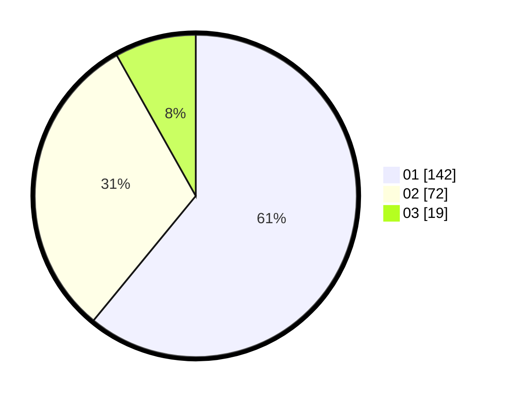

# Hasil

Hasil perolehan suara paslon dapat dilihat pada file paslon-01.txt, paslon-02.txt, dan paslon-03.txt.

Jika tidak ada, artinya data tersebut belum ada pada SIREKAP.

## Perolehan Suara

 * Paslon 01: **142**.
 * Paslon 02: **72**.
 * Paslon 03: **19**.

## Foto C Plano

https://sirekap-obj-formc.kpu.go.id/851b/pemilu/ppwp/31/75/08/10/05/3175081005105-20240214-190040--97d5f524-e78b-4b01-a082-b71dcf0e6257.jpg

https://sirekap-obj-formc.kpu.go.id/851b/pemilu/ppwp/31/75/08/10/05/3175081005105-20240214-184817--29c4a387-50cb-4a58-9edb-f7987b207de1.jpg

https://sirekap-obj-formc.kpu.go.id/851b/pemilu/ppwp/31/75/08/10/05/3175081005105-20240214-192042--b4454a07-c72b-4abe-b6d6-2287b6b8bd60.jpg

## DATA PEMILIH TETAP

Jumlah pemilih dalam DPT: **276**.
 * L: **132**.
 * P: **144**.

## DATA PENGGUNA HAK PILIH

Jumlah pengguna hak pilih dalam DPT: **229**.
 * L: **101**.
 * P: **128**.

Jumlah pengguna hak pilih dalam DPTb: **0**.
 * L: **0**.
 * P: **0**.

Jumlah pengguna hak pilih dalam DPK: **8**.
 * L: **3**.
 * P: **5**.

Jumlah pengguna hak pilih: **237**.
 * L: **104**.
 * P: **133**.

## JUMLAH SUARA SAH DAN TIDAK SAH

JUMLAH SELURUH SUARA SAH: **233**.

JUMLAH SUARA TIDAK SAH: **4**.

JUMLAH SELURUH SUARA SAH DAN SUARA TIDAK SAH: **237**.
