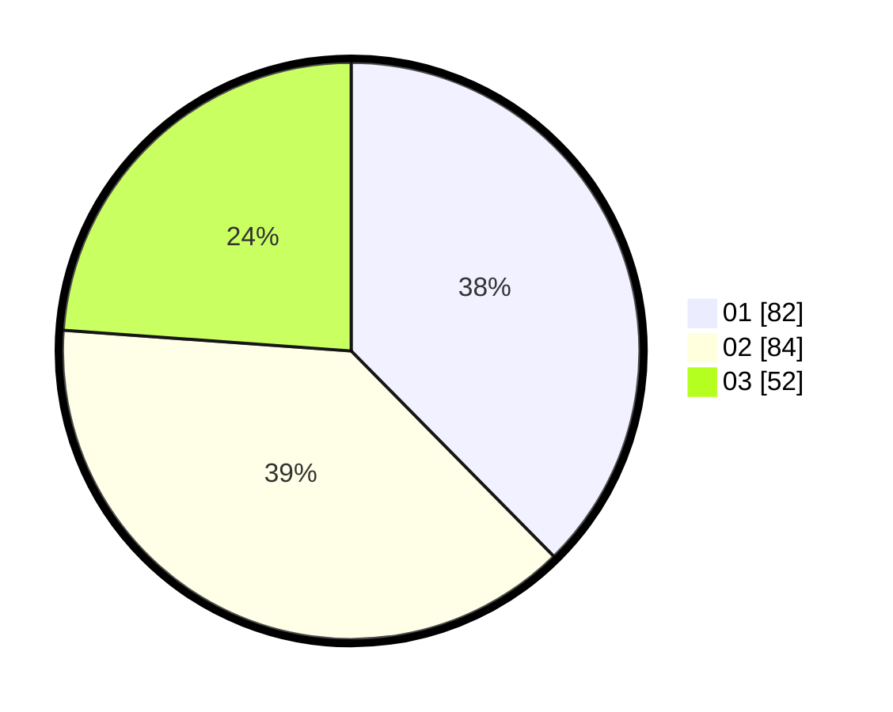

# Hasil

Hasil perolehan suara paslon dapat dilihat pada file paslon-01.txt, paslon-02.txt, dan paslon-03.txt.

Jika tidak ada, artinya data tersebut belum ada pada SIREKAP.

## Perolehan Suara

 * Paslon 01: **82**.
 * Paslon 02: **84**.
 * Paslon 03: **52**.

## Foto C Plano

https://sirekap-obj-formc.kpu.go.id/8b20/pemilu/ppwp/31/75/08/10/05/3175081005107-20240214-211919--55403ed6-ae61-486b-8aa8-d01441a2d31c.jpg

https://sirekap-obj-formc.kpu.go.id/8b20/pemilu/ppwp/31/75/08/10/05/3175081005107-20240214-211947--0da56342-a2ad-43cd-a076-ab3b77db79c0.jpg

https://sirekap-obj-formc.kpu.go.id/8b20/pemilu/ppwp/31/75/08/10/05/3175081005107-20240214-212014--d2a3508f-c2a0-44fa-beb9-871e3f5dc29a.jpg

## DATA PEMILIH TETAP

Jumlah pemilih dalam DPT: **266**.
 * L: **136**.
 * P: **130**.

## DATA PENGGUNA HAK PILIH

Jumlah pengguna hak pilih dalam DPT: **224**.
 * L: **110**.
 * P: **114**.

Jumlah pengguna hak pilih dalam DPTb: **0**.
 * L: **0**.
 * P: **0**.

Jumlah pengguna hak pilih dalam DPK: **1**.
 * L: **0**.
 * P: **1**.

Jumlah pengguna hak pilih: **225**.
 * L: **110**.
 * P: **115**.

## JUMLAH SUARA SAH DAN TIDAK SAH

JUMLAH SELURUH SUARA SAH: **218**.

JUMLAH SUARA TIDAK SAH: **7**.

JUMLAH SELURUH SUARA SAH DAN SUARA TIDAK SAH: **225**.
