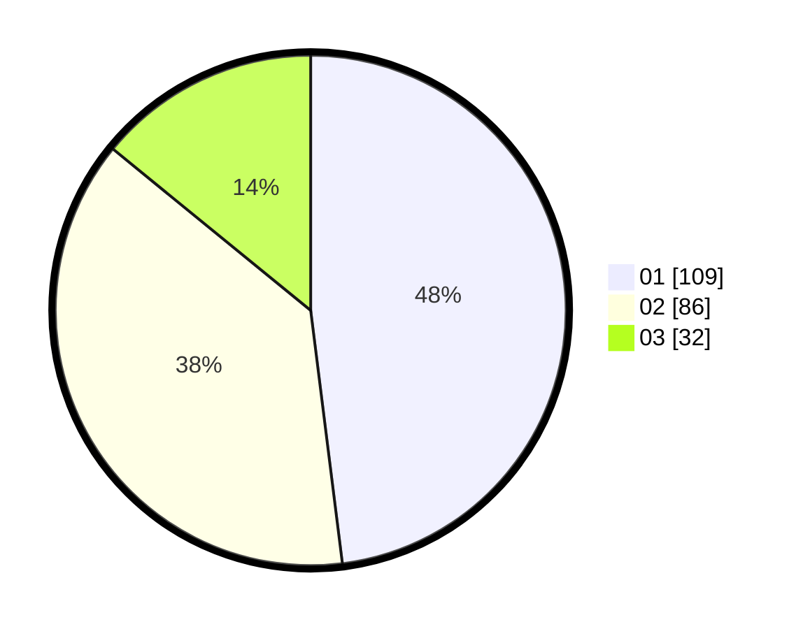

# Hasil

Hasil perolehan suara paslon dapat dilihat pada file paslon-01.txt, paslon-02.txt, dan paslon-03.txt.

Jika tidak ada, artinya data tersebut belum ada pada SIREKAP.

## Perolehan Suara

 * Paslon 01: **109**.
 * Paslon 02: **86**.
 * Paslon 03: **32**.

## Foto C Plano

https://sirekap-obj-formc.kpu.go.id/2408/pemilu/ppwp/31/75/08/10/05/3175081005109-20240215-205244--d6785c38-d56b-4ce5-b13c-f76ce45350fe.jpg

https://sirekap-obj-formc.kpu.go.id/2408/pemilu/ppwp/31/75/08/10/05/3175081005109-20240215-205246--eb98ad97-9f86-4010-a23b-0894b709705f.jpg

https://sirekap-obj-formc.kpu.go.id/2408/pemilu/ppwp/31/75/08/10/05/3175081005109-20240215-205245--ba04600d-b682-4fd3-ae09-e1107018cd0f.jpg

## DATA PEMILIH TETAP

Jumlah pemilih dalam DPT: **277**.
 * L: **130**.
 * P: **147**.

## DATA PENGGUNA HAK PILIH

Jumlah pengguna hak pilih dalam DPT: **229**.
 * L: **105**.
 * P: **124**.

Jumlah pengguna hak pilih dalam DPTb: **1**.
 * L: **0**.
 * P: **1**.

Jumlah pengguna hak pilih dalam DPK: **1**.
 * L: **0**.
 * P: **1**.

Jumlah pengguna hak pilih: **231**.
 * L: **105**.
 * P: **126**.

## JUMLAH SUARA SAH DAN TIDAK SAH

JUMLAH SELURUH SUARA SAH: **227**.

JUMLAH SUARA TIDAK SAH: **4**.

JUMLAH SELURUH SUARA SAH DAN SUARA TIDAK SAH: **231**.
