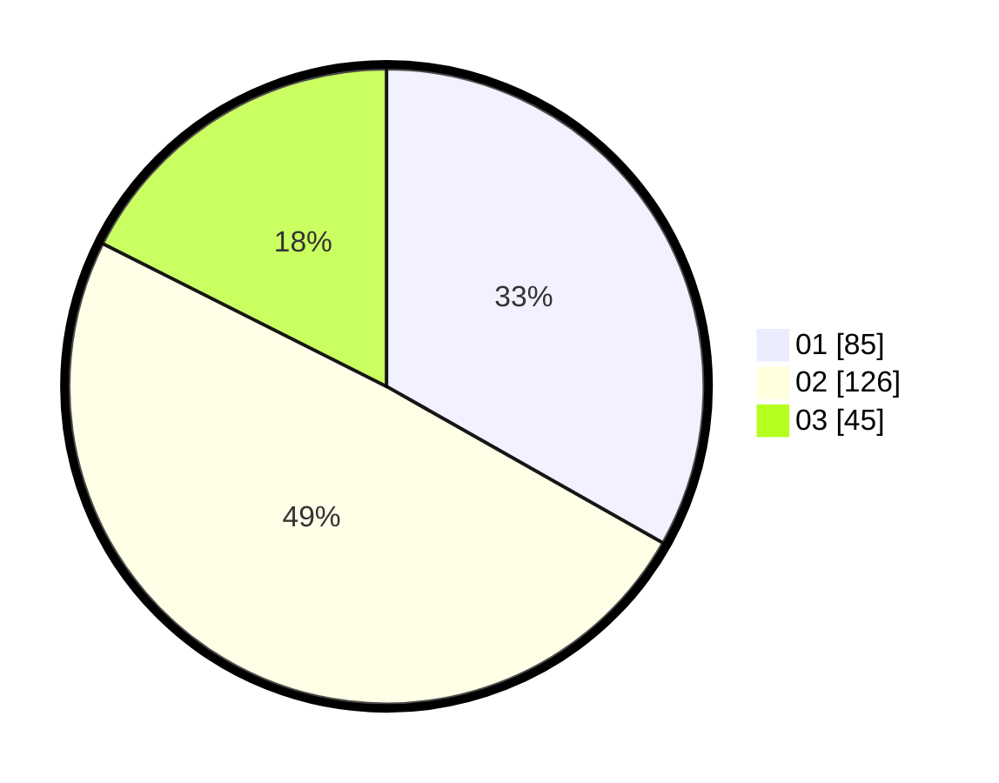

# Hasil

Hasil perolehan suara paslon dapat dilihat pada file paslon-01.txt, paslon-02.txt, dan paslon-03.txt.

Jika tidak ada, artinya data tersebut belum ada pada SIREKAP.

## Perolehan Suara

 * Paslon 01: **85**.
 * Paslon 02: **126**.
 * Paslon 03: **45**.

## Foto C Plano

https://sirekap-obj-formc.kpu.go.id/7fac/pemilu/ppwp/31/75/08/10/05/3175081005110-20240214-155526--a8a1ee30-5e75-4615-a596-da4c44edce88.jpg

https://sirekap-obj-formc.kpu.go.id/7fac/pemilu/ppwp/31/75/08/10/05/3175081005110-20240216-014553--d1ef6487-5259-4e50-8192-d79d0ae721fe.jpg

https://sirekap-obj-formc.kpu.go.id/7fac/pemilu/ppwp/31/75/08/10/05/3175081005110-20240214-155814--f30be172-fb3a-4f83-adf0-1e3ca7b62a73.jpg

## DATA PEMILIH TETAP

Jumlah pemilih dalam DPT: **289**.
 * L: **134**.
 * P: **155**.

## DATA PENGGUNA HAK PILIH

Jumlah pengguna hak pilih dalam DPT: **250**.
 * L: **113**.
 * P: **137**.

Jumlah pengguna hak pilih dalam DPTb: **6**.
 * L: **2**.
 * P: **4**.

Jumlah pengguna hak pilih dalam DPK: **1**.
 * L: **1**.
 * P: **0**.

Jumlah pengguna hak pilih: **257**.
 * L: **116**.
 * P: **141**.

## JUMLAH SUARA SAH DAN TIDAK SAH

JUMLAH SELURUH SUARA SAH: **256**.

JUMLAH SUARA TIDAK SAH: **1**.

JUMLAH SELURUH SUARA SAH DAN SUARA TIDAK SAH: **257**.
