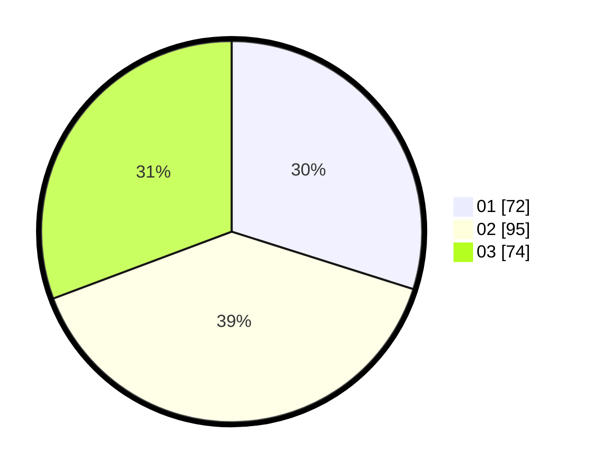

# Hasil

Hasil perolehan suara paslon dapat dilihat pada file paslon-01.txt, paslon-02.txt, dan paslon-03.txt.

Jika tidak ada, artinya data tersebut belum ada pada SIREKAP.

## Perolehan Suara

 * Paslon 01: **72**.
 * Paslon 02: **95**.
 * Paslon 03: **74**.

## Foto C Plano

https://sirekap-obj-formc.kpu.go.id/7b57/pemilu/ppwp/31/75/08/10/05/3175081005111-20240215-200718--a7510318-76d2-453a-bb20-ce4f90de2a35.jpg

https://sirekap-obj-formc.kpu.go.id/7b57/pemilu/ppwp/31/75/08/10/05/3175081005111-20240215-200746--a289186b-fe43-48f6-88c9-83d41e3bc62b.jpg

https://sirekap-obj-formc.kpu.go.id/7b57/pemilu/ppwp/31/75/08/10/05/3175081005111-20240215-200728--67d9c613-e4a5-4996-82c3-c7f21889ea1d.jpg

## DATA PEMILIH TETAP

Jumlah pemilih dalam DPT: **268**.
 * L: **122**.
 * P: **146**.

## DATA PENGGUNA HAK PILIH

Jumlah pengguna hak pilih dalam DPT: **221**.
 * L: **95**.
 * P: **126**.

Jumlah pengguna hak pilih dalam DPTb: **15**.
 * L: **6**.
 * P: **9**.

Jumlah pengguna hak pilih dalam DPK: **8**.
 * L: **3**.
 * P: **5**.

Jumlah pengguna hak pilih: **244**.
 * L: **104**.
 * P: **140**.

## JUMLAH SUARA SAH DAN TIDAK SAH

JUMLAH SELURUH SUARA SAH: **241**.

JUMLAH SUARA TIDAK SAH: **3**.

JUMLAH SELURUH SUARA SAH DAN SUARA TIDAK SAH: **244**.
