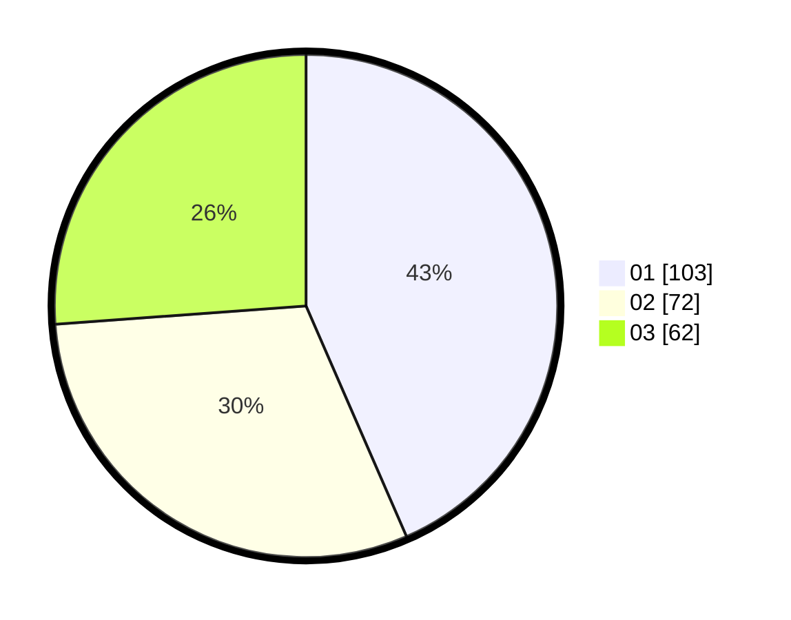

# Hasil

Hasil perolehan suara paslon dapat dilihat pada file paslon-01.txt, paslon-02.txt, dan paslon-03.txt.

Jika tidak ada, artinya data tersebut belum ada pada SIREKAP.

## Perolehan Suara

 * Paslon 01: **103**.
 * Paslon 02: **72**.
 * Paslon 03: **62**.

## Foto C Plano

https://sirekap-obj-formc.kpu.go.id/d06a/pemilu/ppwp/31/75/08/10/05/3175081005114-20240214-185951--a51eb4ac-34fc-4af9-929f-6161060aa145.jpg

https://sirekap-obj-formc.kpu.go.id/d06a/pemilu/ppwp/31/75/08/10/05/3175081005114-20240214-155104--7e29b066-c110-4831-9646-ff75194ed565.jpg

https://sirekap-obj-formc.kpu.go.id/d06a/pemilu/ppwp/31/75/08/10/05/3175081005114-20240214-155120--86e0a333-251d-43d4-a996-b6fde01eda85.jpg

## DATA PEMILIH TETAP

Jumlah pemilih dalam DPT: **270**.
 * L: **118**.
 * P: **152**.

## DATA PENGGUNA HAK PILIH

Jumlah pengguna hak pilih dalam DPT: **219**.
 * L: **94**.
 * P: **125**.

Jumlah pengguna hak pilih dalam DPTb: **19**.
 * L: **4**.
 * P: **15**.

Jumlah pengguna hak pilih dalam DPK: **1**.
 * L: **0**.
 * P: **1**.

Jumlah pengguna hak pilih: **239**.
 * L: **99**.
 * P: **140**.

## JUMLAH SUARA SAH DAN TIDAK SAH

JUMLAH SELURUH SUARA SAH: **237**.

JUMLAH SUARA TIDAK SAH: **2**.

JUMLAH SELURUH SUARA SAH DAN SUARA TIDAK SAH: **239**.
