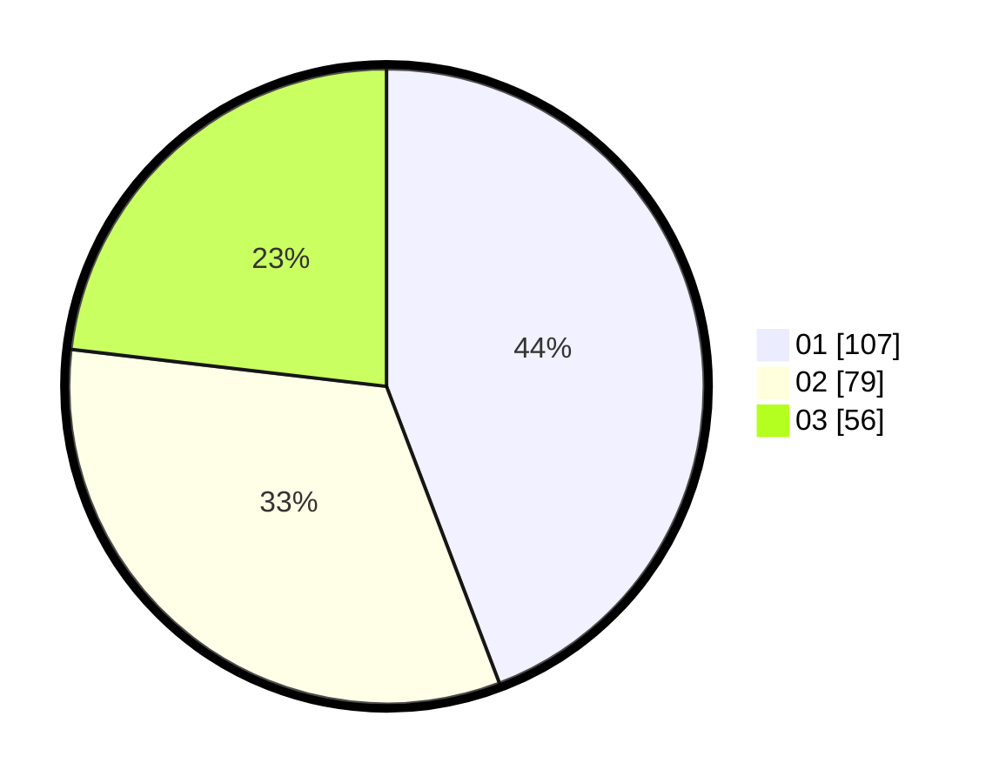

# Hasil

Hasil perolehan suara paslon dapat dilihat pada file paslon-01.txt, paslon-02.txt, dan paslon-03.txt.

Jika tidak ada, artinya data tersebut belum ada pada SIREKAP.

## Perolehan Suara

 * Paslon 01: **107**.
 * Paslon 02: **79**.
 * Paslon 03: **56**.

## Foto C Plano

https://sirekap-obj-formc.kpu.go.id/f486/pemilu/ppwp/31/75/08/10/05/3175081005115-20240214-235010--d8be3173-c086-47f6-9489-bd273680a410.jpg

https://sirekap-obj-formc.kpu.go.id/f486/pemilu/ppwp/31/75/08/10/05/3175081005115-20240214-235441--353160b3-556e-46fd-80df-981d80d5401e.jpg

https://sirekap-obj-formc.kpu.go.id/f486/pemilu/ppwp/31/75/08/10/05/3175081005115-20240214-235812--0383bf28-d9df-4c0a-82a8-0531fcbc39fb.jpg
