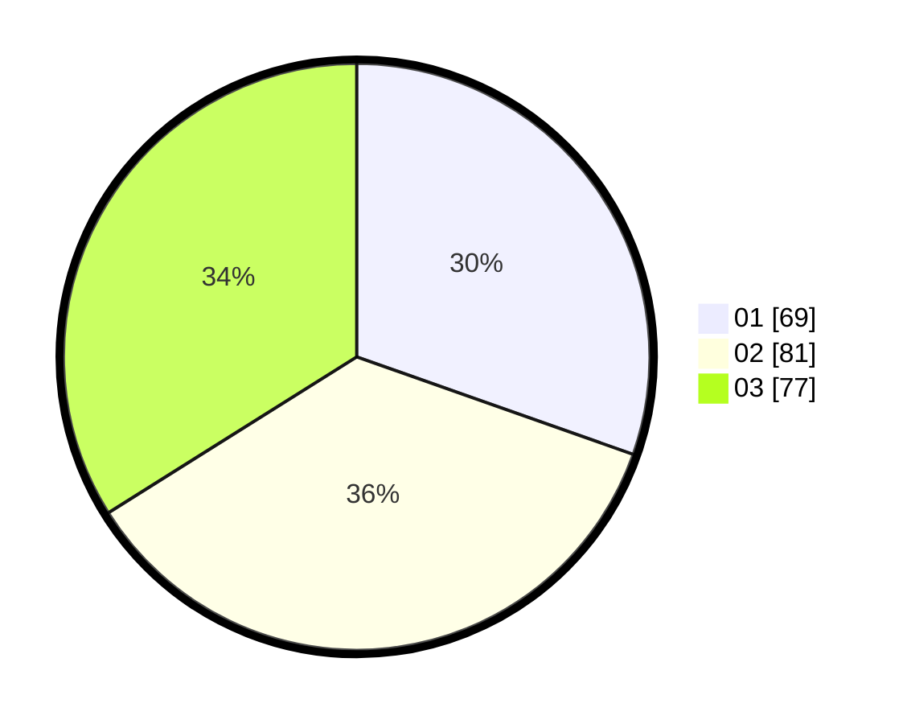

# Hasil

Hasil perolehan suara paslon dapat dilihat pada file paslon-01.txt, paslon-02.txt, dan paslon-03.txt.

Jika tidak ada, artinya data tersebut belum ada pada SIREKAP.

## Perolehan Suara

 * Paslon 01: **69**.
 * Paslon 02: **81**.
 * Paslon 03: **77**.

## Foto C Plano

https://sirekap-obj-formc.kpu.go.id/8ee4/pemilu/ppwp/31/75/08/10/05/3175081005116-20240214-220047--0c4615b1-ece1-4777-abc3-36a756faaeb3.jpg

https://sirekap-obj-formc.kpu.go.id/8ee4/pemilu/ppwp/31/75/08/10/05/3175081005116-20240214-220354--4f26a683-5b4a-4931-ac86-dff72574cf9a.jpg

https://sirekap-obj-formc.kpu.go.id/8ee4/pemilu/ppwp/31/75/08/10/05/3175081005116-20240214-220530--b57ded65-2399-4aba-9fa8-8cf1f7247f33.jpg
