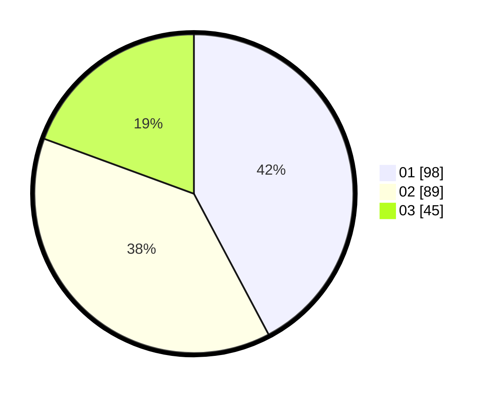

# Hasil

Hasil perolehan suara paslon dapat dilihat pada file paslon-01.txt, paslon-02.txt, dan paslon-03.txt.

Jika tidak ada, artinya data tersebut belum ada pada SIREKAP.

## Perolehan Suara

 * Paslon 01: **98**.
 * Paslon 02: **89**.
 * Paslon 03: **45**.

## Foto C Plano

https://sirekap-obj-formc.kpu.go.id/2012/pemilu/ppwp/31/75/08/10/05/3175081005122-20240215-203221--0d3df824-3dca-435c-9956-2c0ce38b3c47.jpg

https://sirekap-obj-formc.kpu.go.id/2012/pemilu/ppwp/31/75/08/10/05/3175081005122-20240215-203228--5106e765-4670-4450-aea9-ecb9b06c0a12.jpg

https://sirekap-obj-formc.kpu.go.id/2012/pemilu/ppwp/31/75/08/10/05/3175081005122-20240215-203233--c46bc50b-7b10-43f2-979d-0d10fc986441.jpg
