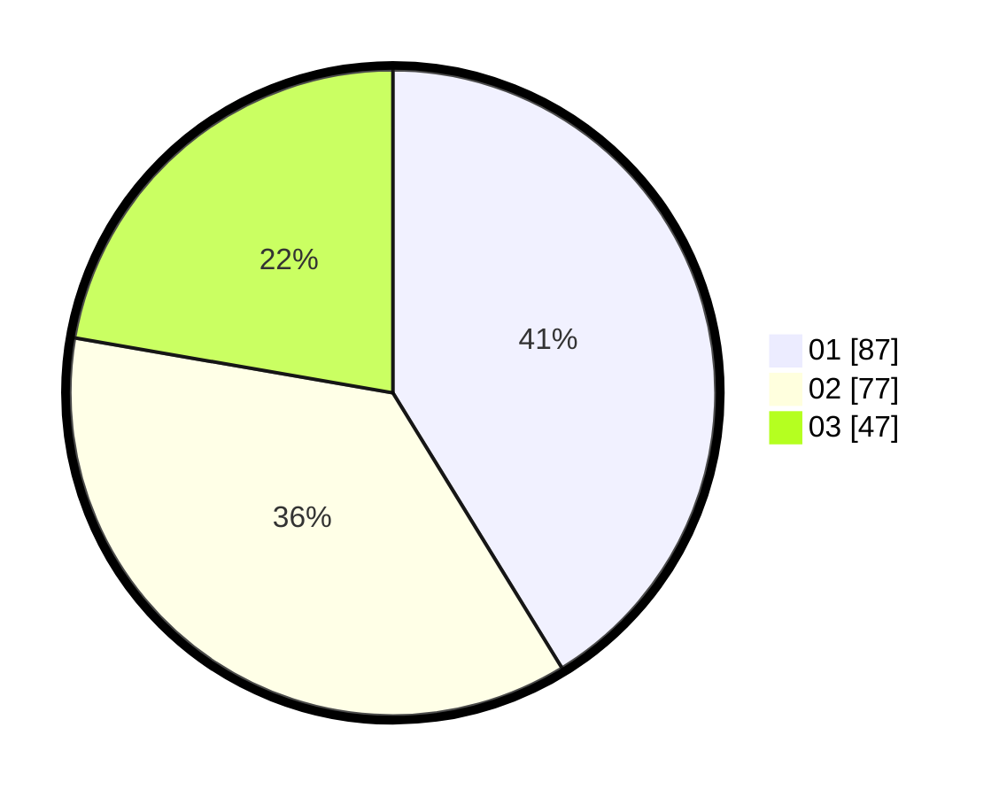

# Hasil

Hasil perolehan suara paslon dapat dilihat pada file paslon-01.txt, paslon-02.txt, dan paslon-03.txt.

Jika tidak ada, artinya data tersebut belum ada pada SIREKAP.

## Perolehan Suara

 * Paslon 01: **87**.
 * Paslon 02: **77**.
 * Paslon 03: **47**.

## Foto C Plano

https://sirekap-obj-formc.kpu.go.id/cd13/pemilu/ppwp/31/75/08/10/05/3175081005123-20240214-204758--ec39379c-6eed-4529-9666-8664fad09fcb.jpg

https://sirekap-obj-formc.kpu.go.id/cd13/pemilu/ppwp/31/75/08/10/05/3175081005123-20240214-204844--d6ca4ed5-0413-4e3c-a0e8-af88bea446f8.jpg

https://sirekap-obj-formc.kpu.go.id/cd13/pemilu/ppwp/31/75/08/10/05/3175081005123-20240214-210348--3d8208f7-198e-4964-8c16-79a44296e221.jpg
