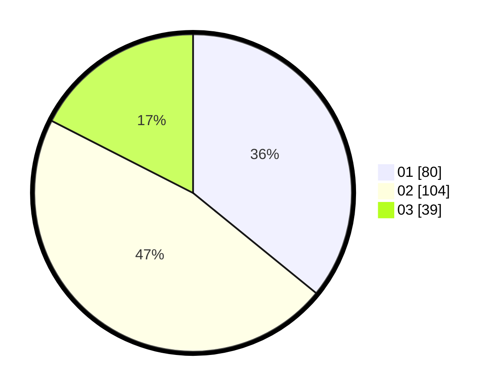

# Hasil

Hasil perolehan suara paslon dapat dilihat pada file paslon-01.txt, paslon-02.txt, dan paslon-03.txt.

Jika tidak ada, artinya data tersebut belum ada pada SIREKAP.

## Perolehan Suara

 * Paslon 01: **80**.
 * Paslon 02: **104**.
 * Paslon 03: **39**.

## Foto C Plano

https://sirekap-obj-formc.kpu.go.id/a7c0/pemilu/ppwp/31/75/08/10/05/3175081005127-20240214-233345--17d84f51-82b4-4925-8542-7f79cd709a6c.jpg

https://sirekap-obj-formc.kpu.go.id/a7c0/pemilu/ppwp/31/75/08/10/05/3175081005127-20240214-233504--f039cde2-76c5-4321-b714-03c161917ff3.jpg

https://sirekap-obj-formc.kpu.go.id/a7c0/pemilu/ppwp/31/75/08/10/05/3175081005127-20240214-233537--c7d9a04f-973c-41a7-8a8c-52112e1a5bb7.jpg
