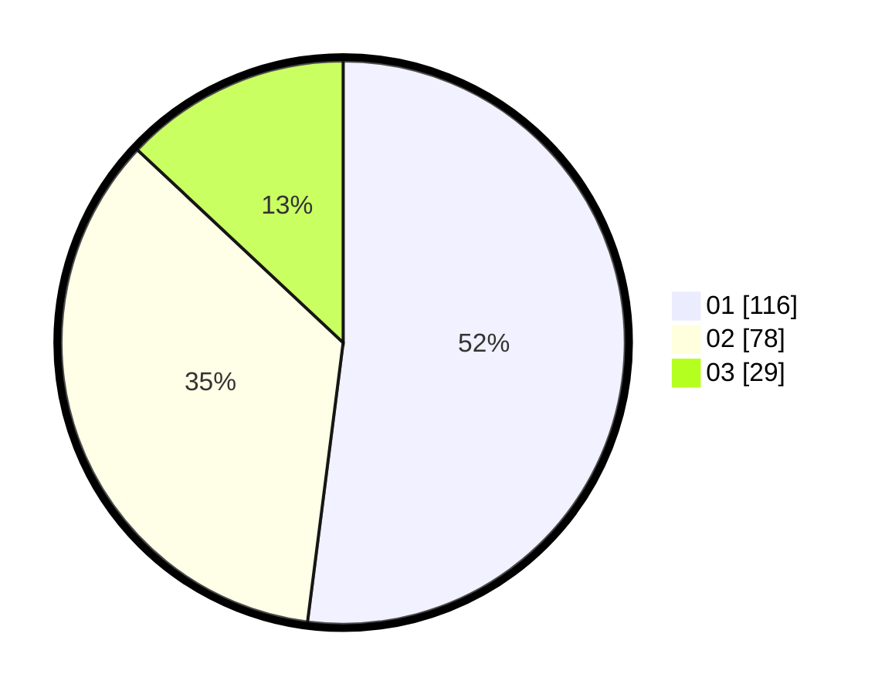

# Hasil

Hasil perolehan suara paslon dapat dilihat pada file paslon-01.txt, paslon-02.txt, dan paslon-03.txt.

Jika tidak ada, artinya data tersebut belum ada pada SIREKAP.

## Perolehan Suara

 * Paslon 01: **116**.
 * Paslon 02: **78**.
 * Paslon 03: **29**.

## Foto C Plano

https://sirekap-obj-formc.kpu.go.id/621a/pemilu/ppwp/31/75/08/10/05/3175081005129-20240216-211504--7dc450bc-7caa-4481-a966-03a63a7922bd.jpg

https://sirekap-obj-formc.kpu.go.id/621a/pemilu/ppwp/31/75/08/10/05/3175081005129-20240216-211505--1c52eb67-9e3f-44de-9bc3-b3e8634d3074.jpg

https://sirekap-obj-formc.kpu.go.id/621a/pemilu/ppwp/31/75/08/10/05/3175081005129-20240216-211504--c617acdd-9c09-4f35-810c-bf7937be2501.jpg

## DATA PEMILIH TETAP

Jumlah pemilih dalam DPT: **285**.
 * L: **136**.
 * P: **149**.

## DATA PENGGUNA HAK PILIH

Jumlah pengguna hak pilih dalam DPT: **228**.
 * L: **105**.
 * P: **123**.

Jumlah pengguna hak pilih dalam DPTb: **0**.
 * L: **0**.
 * P: **0**.

Jumlah pengguna hak pilih dalam DPK: **0**.
 * L: **0**.
 * P: **0**.

Jumlah pengguna hak pilih: **228**.
 * L: **105**.
 * P: **123**.

## JUMLAH SUARA SAH DAN TIDAK SAH

JUMLAH SELURUH SUARA SAH: **223**.

JUMLAH SUARA TIDAK SAH: **6**.

JUMLAH SELURUH SUARA SAH DAN SUARA TIDAK SAH: **229**.
