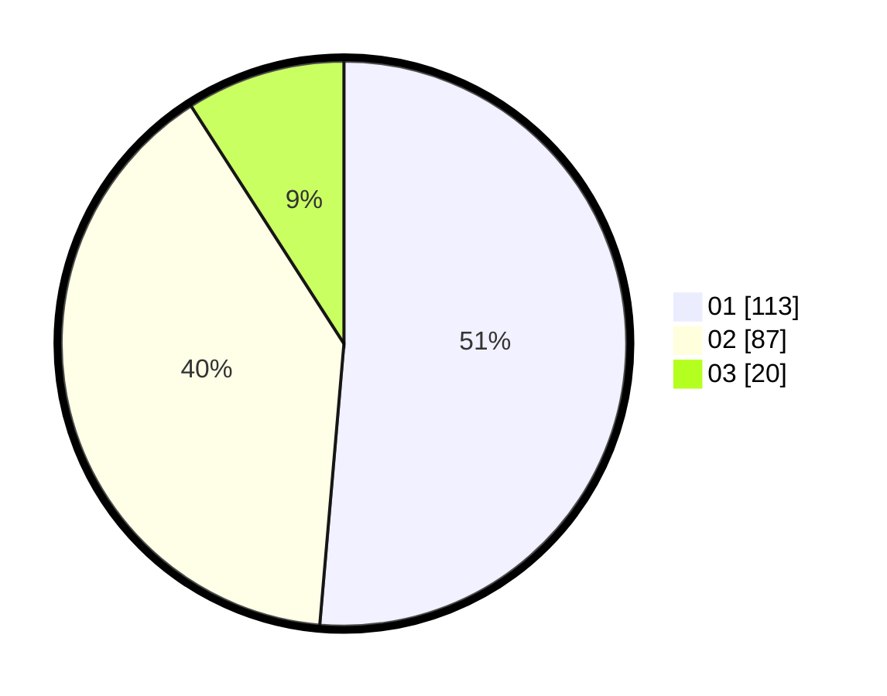

# Hasil

Hasil perolehan suara paslon dapat dilihat pada file paslon-01.txt, paslon-02.txt, dan paslon-03.txt.

Jika tidak ada, artinya data tersebut belum ada pada SIREKAP.

## Perolehan Suara

 * Paslon 01: **113**.
 * Paslon 02: **87**.
 * Paslon 03: **20**.

## Foto C Plano

https://sirekap-obj-formc.kpu.go.id/7ff5/pemilu/ppwp/31/75/08/10/05/3175081005130-20240216-160014--3937ac12-5df5-4abf-872d-0d1f73570d46.jpg

https://sirekap-obj-formc.kpu.go.id/7ff5/pemilu/ppwp/31/75/08/10/05/3175081005130-20240216-160014--b40165a9-3832-4c15-b4bc-28ad0cf689ac.jpg

https://sirekap-obj-formc.kpu.go.id/7ff5/pemilu/ppwp/31/75/08/10/05/3175081005130-20240214-213523--82c06d27-ce86-4875-81ad-688e1c3b84a7.jpg

## DATA PEMILIH TETAP

Jumlah pemilih dalam DPT: **286**.
 * L: **131**.
 * P: **155**.

## DATA PENGGUNA HAK PILIH

Jumlah pengguna hak pilih dalam DPT: **216**.
 * L: **99**.
 * P: **117**.

Jumlah pengguna hak pilih dalam DPTb: **3**.
 * L: **1**.
 * P: **2**.

Jumlah pengguna hak pilih dalam DPK: **8**.
 * L: **5**.
 * P: **3**.

Jumlah pengguna hak pilih: **227**.
 * L: **105**.
 * P: **122**.

## JUMLAH SUARA SAH DAN TIDAK SAH

JUMLAH SELURUH SUARA SAH: **220**.

JUMLAH SUARA TIDAK SAH: **7**.

JUMLAH SELURUH SUARA SAH DAN SUARA TIDAK SAH: **227**.
