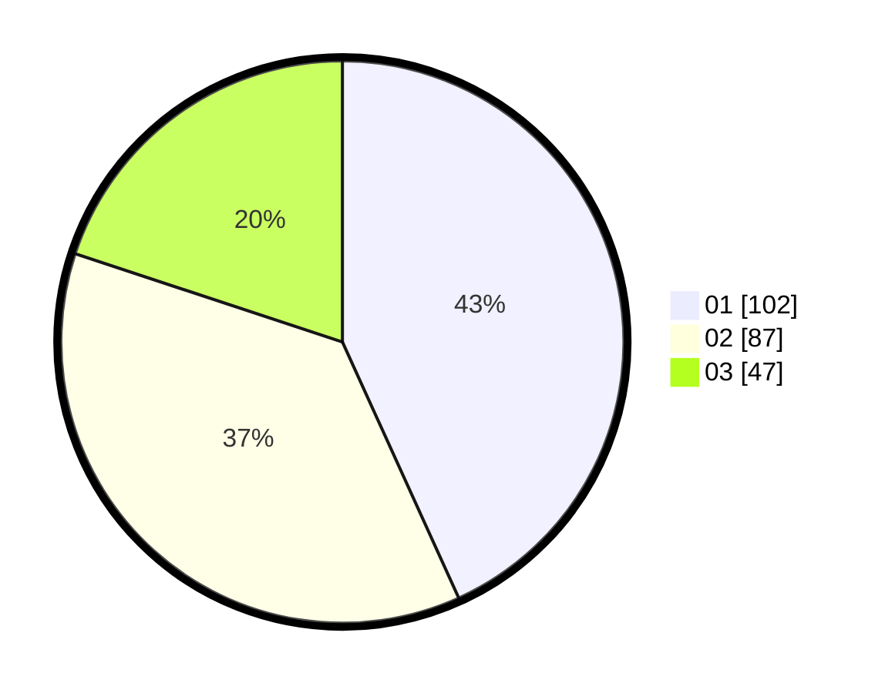

# Hasil

Hasil perolehan suara paslon dapat dilihat pada file paslon-01.txt, paslon-02.txt, dan paslon-03.txt.

Jika tidak ada, artinya data tersebut belum ada pada SIREKAP.

## Perolehan Suara

 * Paslon 01: **102**.
 * Paslon 02: **87**.
 * Paslon 03: **47**.

## Foto C Plano

https://sirekap-obj-formc.kpu.go.id/951a/pemilu/ppwp/31/75/08/10/05/3175081005132-20240216-132623--a4c62ab0-e936-479c-ba7a-a1d225766062.jpg

https://sirekap-obj-formc.kpu.go.id/951a/pemilu/ppwp/31/75/08/10/05/3175081005132-20240216-132625--72f2a49d-fd84-44c3-9aa2-aaae48fc4d37.jpg

https://sirekap-obj-formc.kpu.go.id/951a/pemilu/ppwp/31/75/08/10/05/3175081005132-20240216-132624--5a2b21cd-6e77-40a7-8047-9c62ffb9e417.jpg

## DATA PEMILIH TETAP

Jumlah pemilih dalam DPT: **274**.
 * L: **143**.
 * P: **131**.

## DATA PENGGUNA HAK PILIH

Jumlah pengguna hak pilih dalam DPT: **241**.
 * L: **127**.
 * P: **114**.

Jumlah pengguna hak pilih dalam DPTb: **3**.
 * L: **3**.
 * P: **0**.

Jumlah pengguna hak pilih dalam DPK: **2**.
 * L: **1**.
 * P: **1**.

Jumlah pengguna hak pilih: **246**.
 * L: **131**.
 * P: **115**.

## JUMLAH SUARA SAH DAN TIDAK SAH

JUMLAH SELURUH SUARA SAH: **236**.

JUMLAH SUARA TIDAK SAH: **10**.

JUMLAH SELURUH SUARA SAH DAN SUARA TIDAK SAH: **246**.
