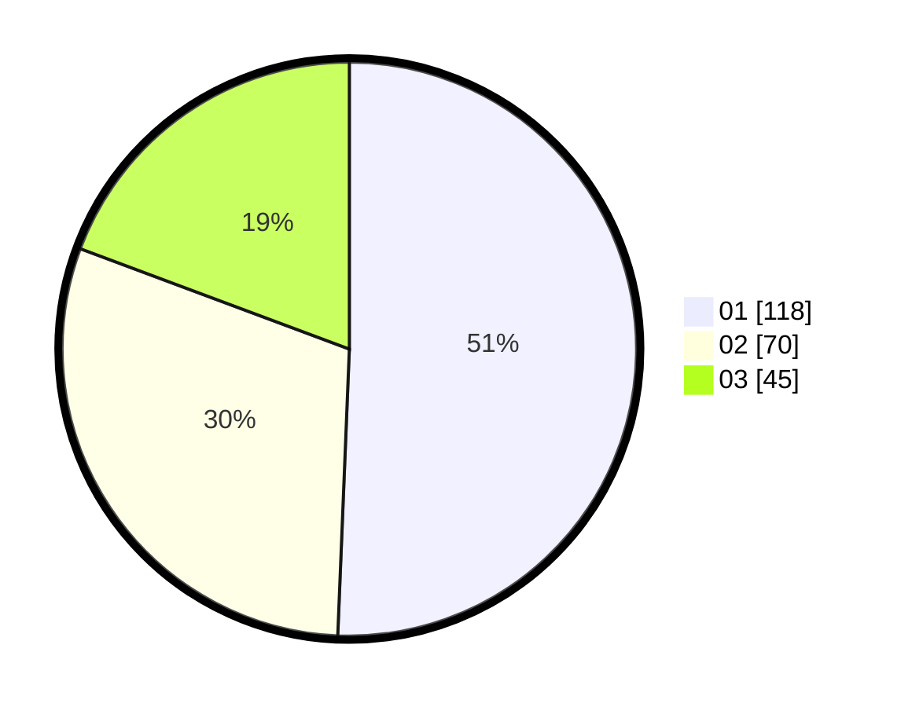

# Hasil

Hasil perolehan suara paslon dapat dilihat pada file paslon-01.txt, paslon-02.txt, dan paslon-03.txt.

Jika tidak ada, artinya data tersebut belum ada pada SIREKAP.

## Perolehan Suara

 * Paslon 01: **118**.
 * Paslon 02: **70**.
 * Paslon 03: **45**.

## Foto C Plano

https://sirekap-obj-formc.kpu.go.id/dc4b/pemilu/ppwp/31/75/08/10/05/3175081005133-20240215-001517--40590285-a56b-4967-8967-e99d0c3cb662.jpg

https://sirekap-obj-formc.kpu.go.id/dc4b/pemilu/ppwp/31/75/08/10/05/3175081005133-20240215-010525--8344f9fd-946f-4b6c-b914-9e3b212f04a6.jpg

https://sirekap-obj-formc.kpu.go.id/dc4b/pemilu/ppwp/31/75/08/10/05/3175081005133-20240215-010613--7bb87515-188a-4d6b-bb74-06966d5f60bf.jpg
