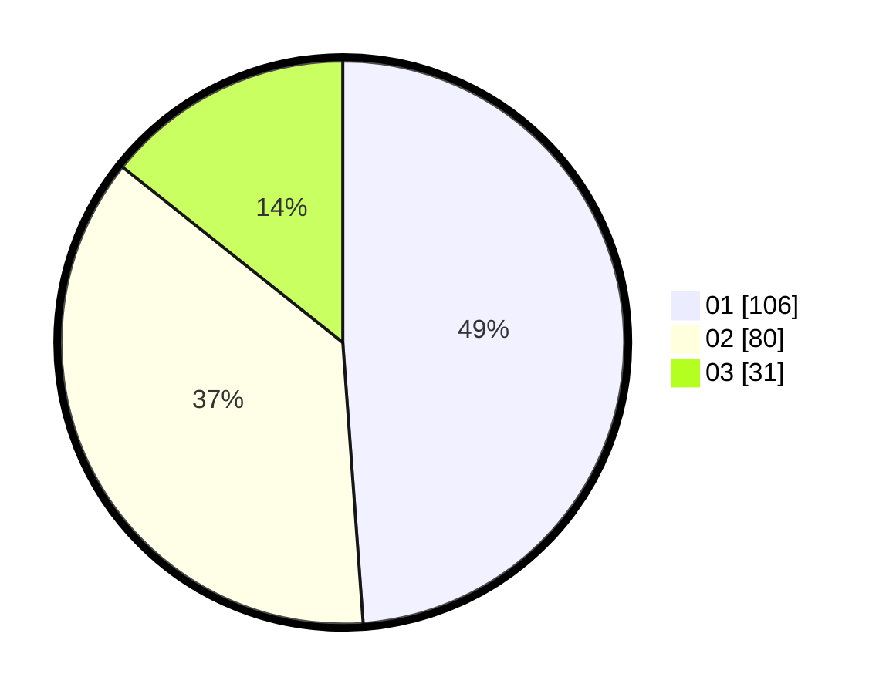

# Hasil

Hasil perolehan suara paslon dapat dilihat pada file paslon-01.txt, paslon-02.txt, dan paslon-03.txt.

Jika tidak ada, artinya data tersebut belum ada pada SIREKAP.

## Perolehan Suara

 * Paslon 01: **106**.
 * Paslon 02: **80**.
 * Paslon 03: **31**.

## Foto C Plano

https://sirekap-obj-formc.kpu.go.id/7779/pemilu/ppwp/31/75/08/10/05/3175081005137-20240216-124557--03907c9f-f6cf-417a-a5ba-647cb72da659.jpg

https://sirekap-obj-formc.kpu.go.id/7779/pemilu/ppwp/31/75/08/10/05/3175081005137-20240216-124559--1e7d25c4-a490-4c80-a1e7-9acecc652a2f.jpg

https://sirekap-obj-formc.kpu.go.id/7779/pemilu/ppwp/31/75/08/10/05/3175081005137-20240216-124558--0eea033d-9704-46b3-9400-55f099bc9dbd.jpg

## DATA PEMILIH TETAP

Jumlah pemilih dalam DPT: **272**.
 * L: **130**.
 * P: **142**.

## DATA PENGGUNA HAK PILIH

Jumlah pengguna hak pilih dalam DPT: **220**.
 * L: **99**.
 * P: **121**.

Jumlah pengguna hak pilih dalam DPTb: **6**.
 * L: **3**.
 * P: **3**.

Jumlah pengguna hak pilih dalam DPK: **2**.
 * L: **0**.
 * P: **2**.

Jumlah pengguna hak pilih: **228**.
 * L: **102**.
 * P: **126**.

## JUMLAH SUARA SAH DAN TIDAK SAH

JUMLAH SELURUH SUARA SAH: **217**.

JUMLAH SUARA TIDAK SAH: **11**.

JUMLAH SELURUH SUARA SAH DAN SUARA TIDAK SAH: **228**.
