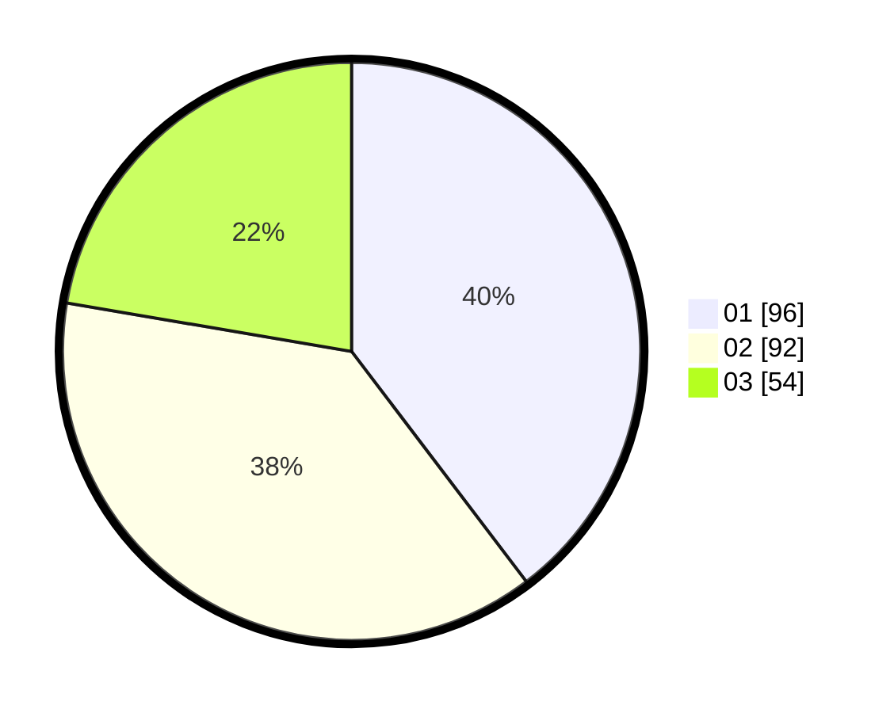

# Hasil

Hasil perolehan suara paslon dapat dilihat pada file paslon-01.txt, paslon-02.txt, dan paslon-03.txt.

Jika tidak ada, artinya data tersebut belum ada pada SIREKAP.

## Perolehan Suara

 * Paslon 01: **96**.
 * Paslon 02: **92**.
 * Paslon 03: **54**.

## Foto C Plano

https://sirekap-obj-formc.kpu.go.id/25da/pemilu/ppwp/31/75/08/10/05/3175081005138-20240214-162216--ef303e98-0f90-45c2-a4d9-1abb5e913578.jpg

https://sirekap-obj-formc.kpu.go.id/25da/pemilu/ppwp/31/75/08/10/05/3175081005138-20240216-144505--ce04791f-e8bc-4612-9939-57fe78d90ce2.jpg

https://sirekap-obj-formc.kpu.go.id/25da/pemilu/ppwp/31/75/08/10/05/3175081005138-20240216-144504--5441597a-a972-4fa6-b454-8f3e1b5cab03.jpg

## DATA PEMILIH TETAP

Jumlah pemilih dalam DPT: **289**.
 * L: **142**.
 * P: **147**.

## DATA PENGGUNA HAK PILIH

Jumlah pengguna hak pilih dalam DPT: **237**.
 * L: **113**.
 * P: **124**.

Jumlah pengguna hak pilih dalam DPTb: **2**.
 * L: **1**.
 * P: **1**.

Jumlah pengguna hak pilih dalam DPK: **4**.
 * L: **1**.
 * P: **3**.

Jumlah pengguna hak pilih: **243**.
 * L: **115**.
 * P: **128**.

## JUMLAH SUARA SAH DAN TIDAK SAH

JUMLAH SELURUH SUARA SAH: **242**.

JUMLAH SUARA TIDAK SAH: **1**.

JUMLAH SELURUH SUARA SAH DAN SUARA TIDAK SAH: **243**.
