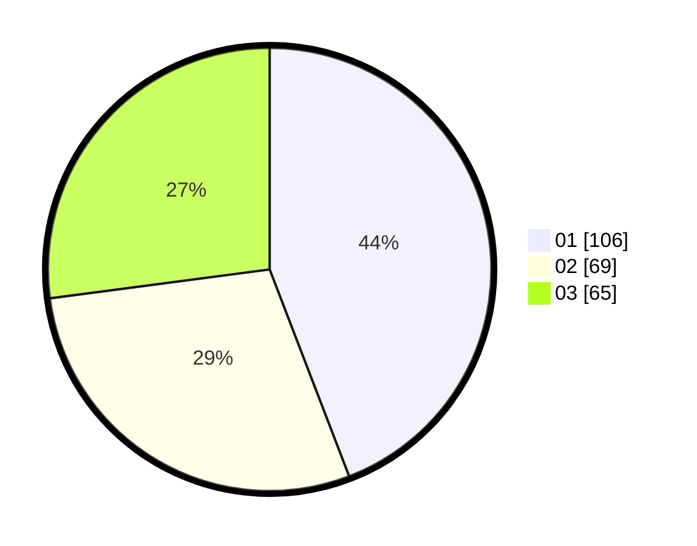

# Hasil

Hasil perolehan suara paslon dapat dilihat pada file paslon-01.txt, paslon-02.txt, dan paslon-03.txt.

Jika tidak ada, artinya data tersebut belum ada pada SIREKAP.

## Perolehan Suara

 * Paslon 01: **106**.
 * Paslon 02: **69**.
 * Paslon 03: **65**.

## Foto C Plano

https://sirekap-obj-formc.kpu.go.id/4288/pemilu/ppwp/31/75/08/10/05/3175081005139-20240214-234351--6c4c1d03-44ae-411e-94e4-bb934e23b954.jpg

https://sirekap-obj-formc.kpu.go.id/4288/pemilu/ppwp/31/75/08/10/05/3175081005139-20240214-235321--995be724-4304-4306-a4d2-4f86a729a53a.jpg

https://sirekap-obj-formc.kpu.go.id/4288/pemilu/ppwp/31/75/08/10/05/3175081005139-20240214-234956--5d64de6c-9aec-4875-819a-997021c1b260.jpg
