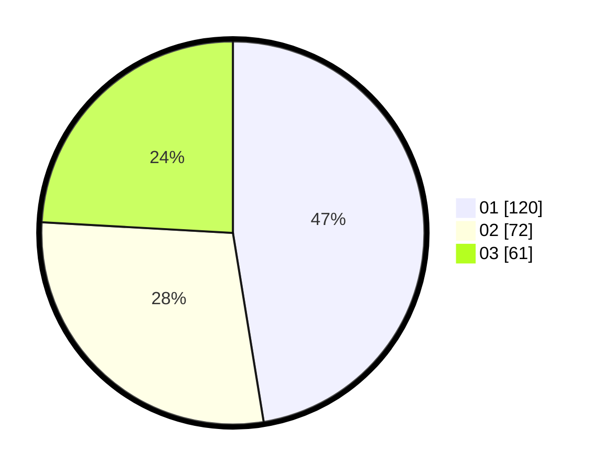

# Hasil

Hasil perolehan suara paslon dapat dilihat pada file paslon-01.txt, paslon-02.txt, dan paslon-03.txt.

Jika tidak ada, artinya data tersebut belum ada pada SIREKAP.

## Perolehan Suara

 * Paslon 01: **120**.
 * Paslon 02: **72**.
 * Paslon 03: **61**.

## Foto C Plano

https://sirekap-obj-formc.kpu.go.id/f1d2/pemilu/ppwp/31/75/08/10/05/3175081005140-20240214-192541--086a6f7c-bc2f-480d-89f5-c02f95e1084b.jpg

https://sirekap-obj-formc.kpu.go.id/f1d2/pemilu/ppwp/31/75/08/10/05/3175081005140-20240214-192643--116de63f-b673-4100-af4d-dec070c9adfe.jpg

https://sirekap-obj-formc.kpu.go.id/f1d2/pemilu/ppwp/31/75/08/10/05/3175081005140-20240214-193816--9ed4aa67-7588-4998-ba11-0782ec50c813.jpg

## DATA PEMILIH TETAP

Jumlah pemilih dalam DPT: **292**.
 * L: **132**.
 * P: **160**.

## DATA PENGGUNA HAK PILIH

Jumlah pengguna hak pilih dalam DPT: **253**.
 * L: **111**.
 * P: **142**.

Jumlah pengguna hak pilih dalam DPTb: **5**.
 * L: **0**.
 * P: **5**.

Jumlah pengguna hak pilih dalam DPK: **1**.
 * L: **0**.
 * P: **1**.

Jumlah pengguna hak pilih: **259**.
 * L: **111**.
 * P: **148**.

## JUMLAH SUARA SAH DAN TIDAK SAH

JUMLAH SELURUH SUARA SAH: **253**.

JUMLAH SUARA TIDAK SAH: **6**.

JUMLAH SELURUH SUARA SAH DAN SUARA TIDAK SAH: **259**.
