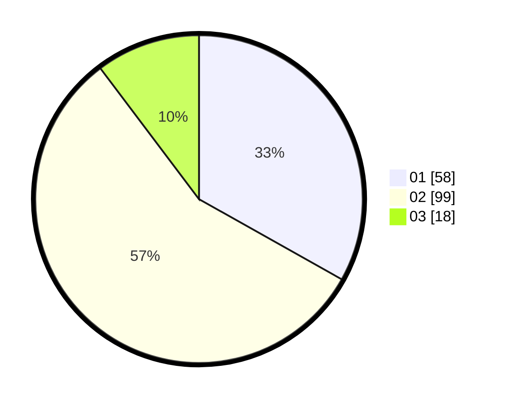

# Hasil

Hasil perolehan suara paslon dapat dilihat pada file paslon-01.txt, paslon-02.txt, dan paslon-03.txt.

Jika tidak ada, artinya data tersebut belum ada pada SIREKAP.

## Perolehan Suara

 * Paslon 01: **58**.
 * Paslon 02: **99**.
 * Paslon 03: **18**.

## Foto C Plano

https://sirekap-obj-formc.kpu.go.id/f3f9/pemilu/ppwp/31/75/09/10/01/3175091001002-20240217-200820--005e2865-63e1-4398-bd8d-ed038b07b65a.jpg

https://sirekap-obj-formc.kpu.go.id/f3f9/pemilu/ppwp/31/75/09/10/01/3175091001002-20240217-200822--e790cafd-02d7-447b-8970-68b9f16649bd.jpg

https://sirekap-obj-formc.kpu.go.id/f3f9/pemilu/ppwp/31/75/09/10/01/3175091001002-20240217-200821--6e175b22-d77b-45b9-a3a8-51c6c53c99eb.jpg

## DATA PEMILIH TETAP

Jumlah pemilih dalam DPT: **249**.
 * L: **122**.
 * P: **127**.

## DATA PENGGUNA HAK PILIH

Jumlah pengguna hak pilih dalam DPT: **178**.
 * L: **81**.
 * P: **97**.

Jumlah pengguna hak pilih dalam DPTb: **0**.
 * L: **0**.
 * P: **0**.

Jumlah pengguna hak pilih dalam DPK: **0**.
 * L: **0**.
 * P: **0**.

Jumlah pengguna hak pilih: **178**.
 * L: **81**.
 * P: **97**.

## JUMLAH SUARA SAH DAN TIDAK SAH

JUMLAH SELURUH SUARA SAH: **175**.

JUMLAH SUARA TIDAK SAH: **3**.

JUMLAH SELURUH SUARA SAH DAN SUARA TIDAK SAH: **178**.
