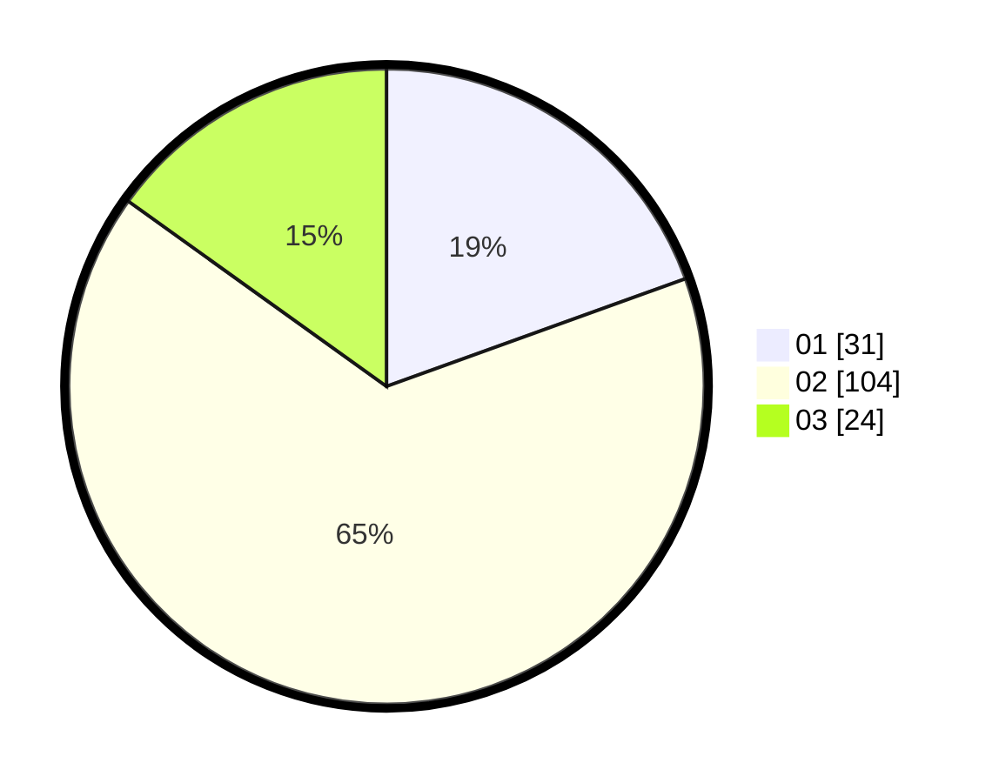

# Hasil

Hasil perolehan suara paslon dapat dilihat pada file paslon-01.txt, paslon-02.txt, dan paslon-03.txt.

Jika tidak ada, artinya data tersebut belum ada pada SIREKAP.

## Perolehan Suara

 * Paslon 01: **31**.
 * Paslon 02: **104**.
 * Paslon 03: **24**.

## Foto C Plano

https://sirekap-obj-formc.kpu.go.id/7b6e/pemilu/ppwp/31/75/09/10/01/3175091001004-20240214-221401--28bde513-14ff-49fa-862b-9ff2e8b85db4.jpg

https://sirekap-obj-formc.kpu.go.id/7b6e/pemilu/ppwp/31/75/09/10/01/3175091001004-20240214-221444--db7fe9d8-32d0-4988-9efa-e888bf2e5677.jpg

https://sirekap-obj-formc.kpu.go.id/7b6e/pemilu/ppwp/31/75/09/10/01/3175091001004-20240214-221523--119b9db2-ba8d-4ce8-8e11-d0a42cbb5a92.jpg
