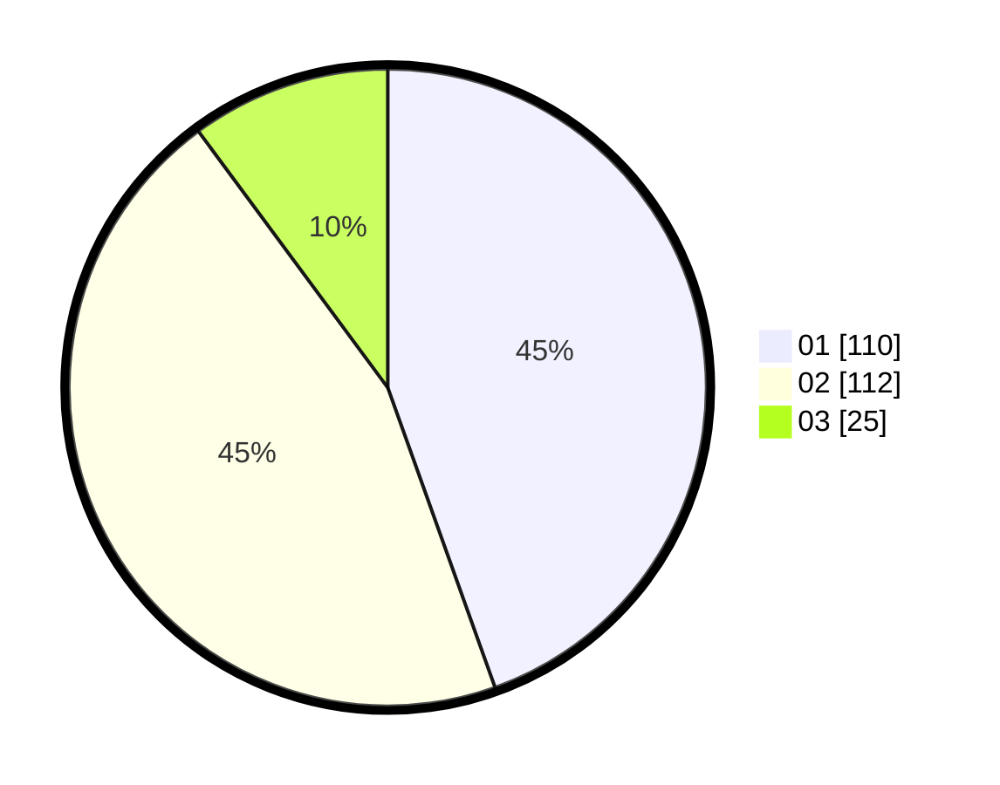

# Hasil

Hasil perolehan suara paslon dapat dilihat pada file paslon-01.txt, paslon-02.txt, dan paslon-03.txt.

Jika tidak ada, artinya data tersebut belum ada pada SIREKAP.

## Perolehan Suara

 * Paslon 01: **110**.
 * Paslon 02: **112**.
 * Paslon 03: **25**.

## Foto C Plano

https://sirekap-obj-formc.kpu.go.id/94d0/pemilu/ppwp/31/75/09/10/01/3175091001011-20240214-160058--7241e30b-861b-4a3d-b4db-b55c0ab79cb4.jpg

https://sirekap-obj-formc.kpu.go.id/94d0/pemilu/ppwp/31/75/09/10/01/3175091001011-20240214-155846--44cb95cd-d04a-4bf3-8ee5-7ee34186006b.jpg

https://sirekap-obj-formc.kpu.go.id/94d0/pemilu/ppwp/31/75/09/10/01/3175091001011-20240214-160107--e54c65fb-32e7-48dc-8af1-6e5257d9151a.jpg
