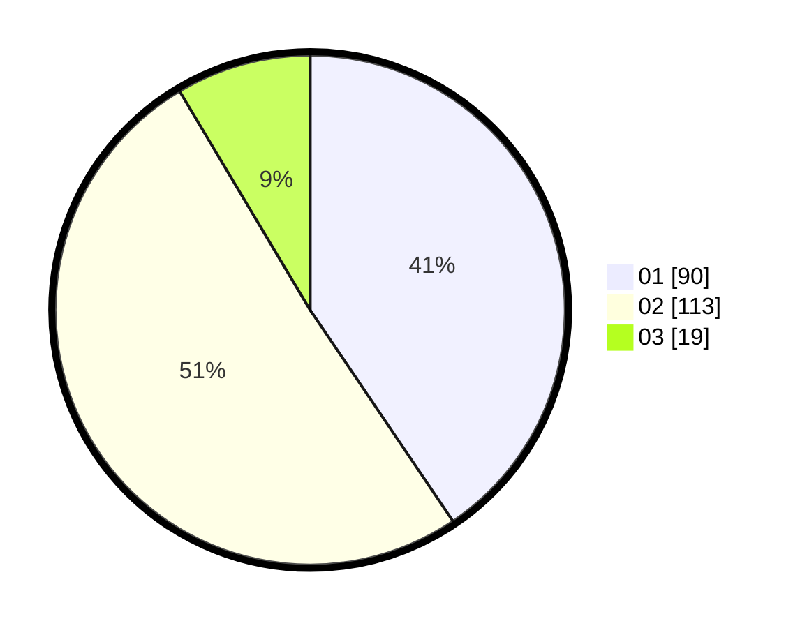

# Hasil

Hasil perolehan suara paslon dapat dilihat pada file paslon-01.txt, paslon-02.txt, dan paslon-03.txt.

Jika tidak ada, artinya data tersebut belum ada pada SIREKAP.

## Perolehan Suara

 * Paslon 01: **90**.
 * Paslon 02: **113**.
 * Paslon 03: **19**.

## Foto C Plano

https://sirekap-obj-formc.kpu.go.id/fd81/pemilu/ppwp/31/75/09/10/01/3175091001014-20240216-235734--e5da037e-d211-48a1-a077-6e0a63142f63.jpg

https://sirekap-obj-formc.kpu.go.id/fd81/pemilu/ppwp/31/75/09/10/01/3175091001014-20240216-235735--a1266705-ca77-4104-8179-64facb54231a.jpg

https://sirekap-obj-formc.kpu.go.id/fd81/pemilu/ppwp/31/75/09/10/01/3175091001014-20240216-235734--3c93251b-4a39-4a92-a7bf-ef0fff707aa3.jpg

## DATA PEMILIH TETAP

Jumlah pemilih dalam DPT: **280**.
 * L: **146**.
 * P: **134**.

## DATA PENGGUNA HAK PILIH

Jumlah pengguna hak pilih dalam DPT: **229**.
 * L: **117**.
 * P: **112**.

Jumlah pengguna hak pilih dalam DPTb: **0**.
 * L: **0**.
 * P: **0**.

Jumlah pengguna hak pilih dalam DPK: **0**.
 * L: **0**.
 * P: **0**.

Jumlah pengguna hak pilih: **229**.
 * L: **117**.
 * P: **112**.

## JUMLAH SUARA SAH DAN TIDAK SAH

JUMLAH SELURUH SUARA SAH: **222**.

JUMLAH SUARA TIDAK SAH: **7**.

JUMLAH SELURUH SUARA SAH DAN SUARA TIDAK SAH: **229**.
