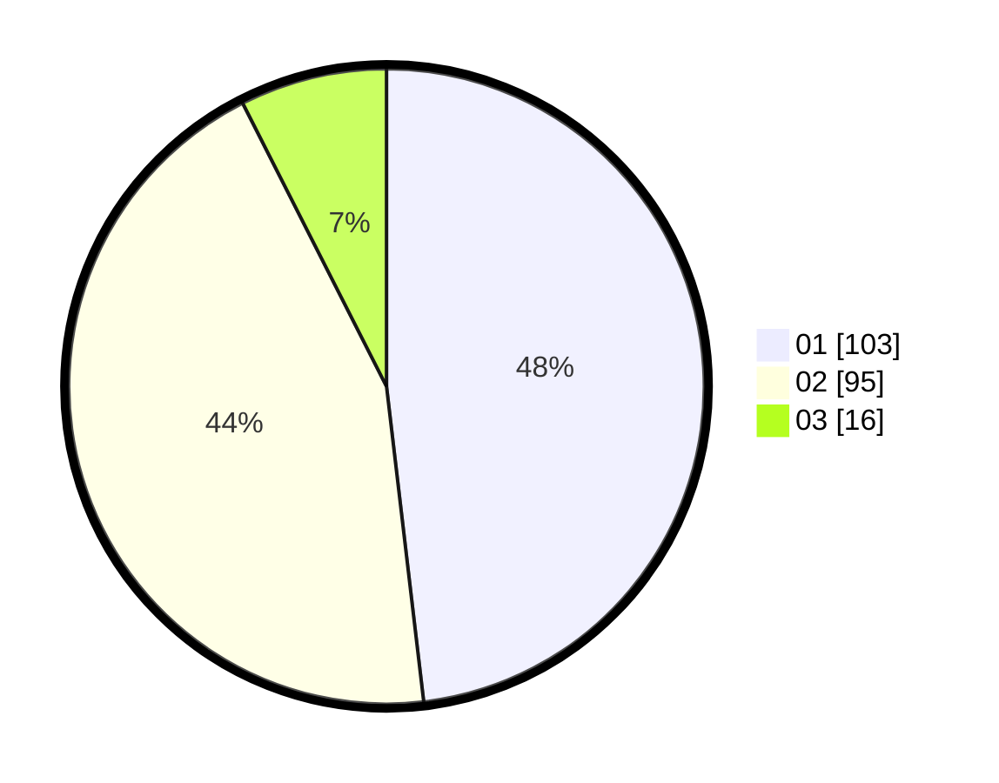

# Hasil

Hasil perolehan suara paslon dapat dilihat pada file paslon-01.txt, paslon-02.txt, dan paslon-03.txt.

Jika tidak ada, artinya data tersebut belum ada pada SIREKAP.

## Perolehan Suara

 * Paslon 01: **103**.
 * Paslon 02: **95**.
 * Paslon 03: **16**.

## Foto C Plano

https://sirekap-obj-formc.kpu.go.id/8294/pemilu/ppwp/31/75/09/10/01/3175091001015-20240217-235558--483e5f5a-c7e3-4247-bde4-64752c656d17.jpg

https://sirekap-obj-formc.kpu.go.id/8294/pemilu/ppwp/31/75/09/10/01/3175091001015-20240217-235600--a515a31b-888a-4ff7-a7d9-17a6551adc46.jpg

https://sirekap-obj-formc.kpu.go.id/8294/pemilu/ppwp/31/75/09/10/01/3175091001015-20240217-235559--abe00add-9cee-43b3-8c64-67b5780be97b.jpg

## DATA PEMILIH TETAP

Jumlah pemilih dalam DPT: **279**.
 * L: **144**.
 * P: **135**.

## DATA PENGGUNA HAK PILIH

Jumlah pengguna hak pilih dalam DPT: **214**.
 * L: **105**.
 * P: **109**.

Jumlah pengguna hak pilih dalam DPTb: **0**.
 * L: **0**.
 * P: **0**.

Jumlah pengguna hak pilih dalam DPK: **5**.
 * L: **3**.
 * P: **2**.

Jumlah pengguna hak pilih: **219**.
 * L: **108**.
 * P: **111**.

## JUMLAH SUARA SAH DAN TIDAK SAH

JUMLAH SELURUH SUARA SAH: **214**.

JUMLAH SUARA TIDAK SAH: **5**.

JUMLAH SELURUH SUARA SAH DAN SUARA TIDAK SAH: **219**.
