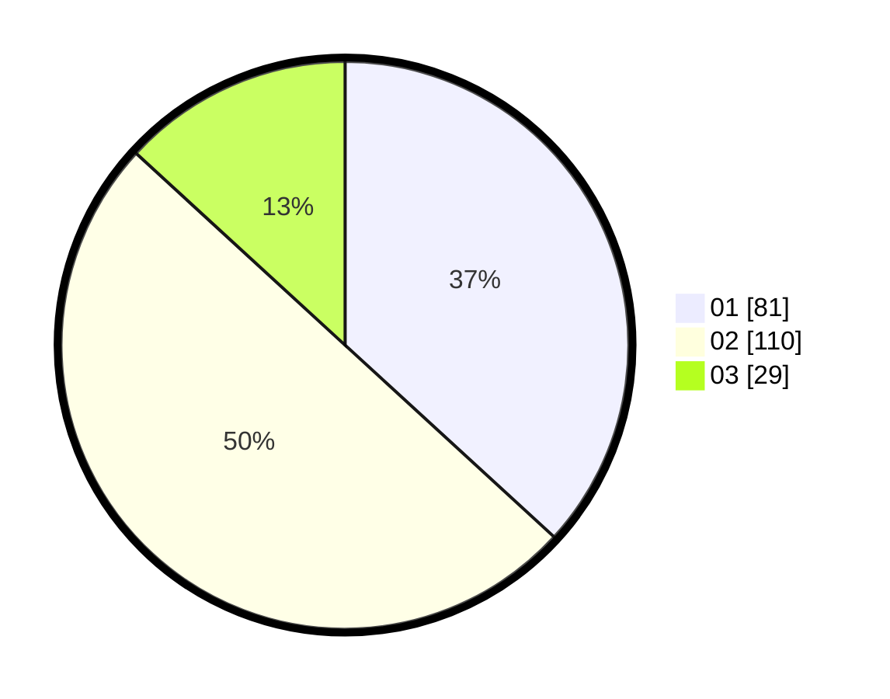

# Hasil

Hasil perolehan suara paslon dapat dilihat pada file paslon-01.txt, paslon-02.txt, dan paslon-03.txt.

Jika tidak ada, artinya data tersebut belum ada pada SIREKAP.

## Perolehan Suara

 * Paslon 01: **81**.
 * Paslon 02: **110**.
 * Paslon 03: **29**.

## Foto C Plano

https://sirekap-obj-formc.kpu.go.id/f397/pemilu/ppwp/31/75/09/10/01/3175091001019-20240216-055523--c2ac8419-916f-41c2-9d2e-1da6d5007f1d.jpg

https://sirekap-obj-formc.kpu.go.id/f397/pemilu/ppwp/31/75/09/10/01/3175091001019-20240216-055524--7d0452dd-0feb-4503-b9a1-161917aadace.jpg

https://sirekap-obj-formc.kpu.go.id/f397/pemilu/ppwp/31/75/09/10/01/3175091001019-20240216-055523--e73511b5-9bcf-4736-920c-107ce238328a.jpg

## DATA PEMILIH TETAP

Jumlah pemilih dalam DPT: **282**.
 * L: **152**.
 * P: **130**.

## DATA PENGGUNA HAK PILIH

Jumlah pengguna hak pilih dalam DPT: **220**.
 * L: **116**.
 * P: **104**.

Jumlah pengguna hak pilih dalam DPTb: **0**.
 * L: **0**.
 * P: **0**.

Jumlah pengguna hak pilih dalam DPK: **3**.
 * L: **2**.
 * P: **1**.

Jumlah pengguna hak pilih: **223**.
 * L: **118**.
 * P: **105**.

## JUMLAH SUARA SAH DAN TIDAK SAH

JUMLAH SELURUH SUARA SAH: **220**.

JUMLAH SUARA TIDAK SAH: **3**.

JUMLAH SELURUH SUARA SAH DAN SUARA TIDAK SAH: **223**.
