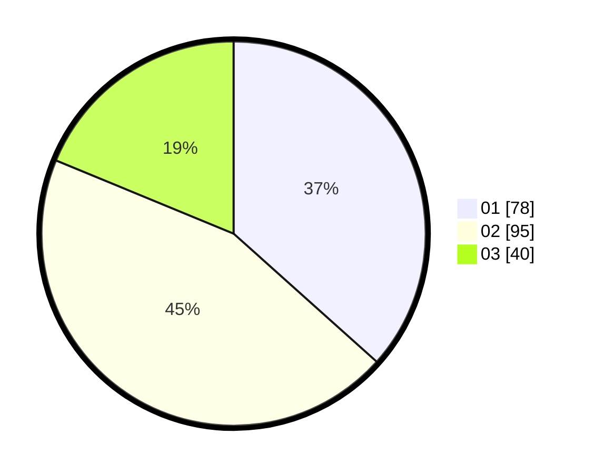

# Hasil

Hasil perolehan suara paslon dapat dilihat pada file paslon-01.txt, paslon-02.txt, dan paslon-03.txt.

Jika tidak ada, artinya data tersebut belum ada pada SIREKAP.

## Perolehan Suara

 * Paslon 01: **78**.
 * Paslon 02: **95**.
 * Paslon 03: **40**.

## Foto C Plano

https://sirekap-obj-formc.kpu.go.id/2979/pemilu/ppwp/31/75/09/10/01/3175091001025-20240214-234735--122d8d40-141d-426d-a986-f927cade03d0.jpg

https://sirekap-obj-formc.kpu.go.id/2979/pemilu/ppwp/31/75/09/10/01/3175091001025-20240214-234857--7103e8c1-edc5-4dcc-a379-eaae88e34aeb.jpg

https://sirekap-obj-formc.kpu.go.id/2979/pemilu/ppwp/31/75/09/10/01/3175091001025-20240214-234935--eddf0b34-bb1e-4efd-9945-03e13581349a.jpg
