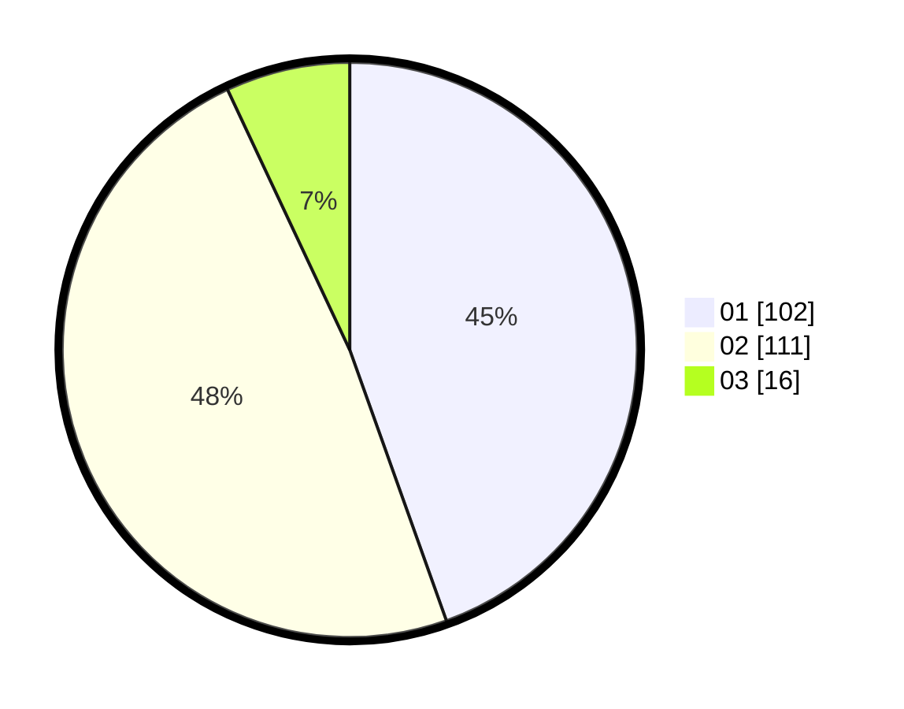

# Hasil

Hasil perolehan suara paslon dapat dilihat pada file paslon-01.txt, paslon-02.txt, dan paslon-03.txt.

Jika tidak ada, artinya data tersebut belum ada pada SIREKAP.

## Perolehan Suara

 * Paslon 01: **102**.
 * Paslon 02: **111**.
 * Paslon 03: **16**.

## Foto C Plano

https://sirekap-obj-formc.kpu.go.id/2488/pemilu/ppwp/31/75/09/10/01/3175091001039-20240216-023907--d35deefa-c4d3-492b-b3e5-d45342b616ea.jpg

https://sirekap-obj-formc.kpu.go.id/2488/pemilu/ppwp/31/75/09/10/01/3175091001039-20240216-023909--86a728b2-566b-4dfa-9bd2-2d55fc6c20aa.jpg

https://sirekap-obj-formc.kpu.go.id/2488/pemilu/ppwp/31/75/09/10/01/3175091001039-20240216-023908--b02c8564-d811-4b6e-92c0-024fbd5e5aee.jpg

## DATA PEMILIH TETAP

Jumlah pemilih dalam DPT: **269**.
 * L: **132**.
 * P: **137**.

## DATA PENGGUNA HAK PILIH

Jumlah pengguna hak pilih dalam DPT: **229**.
 * L: **106**.
 * P: **123**.

Jumlah pengguna hak pilih dalam DPTb: **1**.
 * L: **1**.
 * P: **0**.

Jumlah pengguna hak pilih dalam DPK: **2**.
 * L: **1**.
 * P: **1**.

Jumlah pengguna hak pilih: **232**.
 * L: **108**.
 * P: **124**.

## JUMLAH SUARA SAH DAN TIDAK SAH

JUMLAH SELURUH SUARA SAH: **229**.

JUMLAH SUARA TIDAK SAH: **3**.

JUMLAH SELURUH SUARA SAH DAN SUARA TIDAK SAH: **232**.
