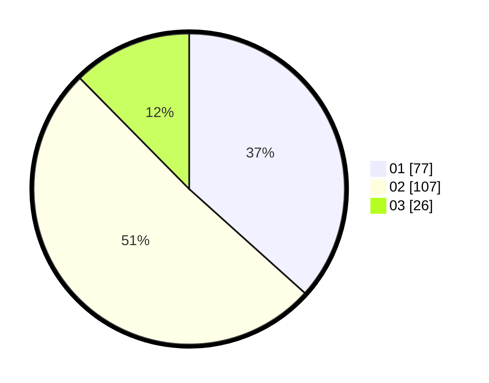

# Hasil

Hasil perolehan suara paslon dapat dilihat pada file paslon-01.txt, paslon-02.txt, dan paslon-03.txt.

Jika tidak ada, artinya data tersebut belum ada pada SIREKAP.

## Perolehan Suara

 * Paslon 01: **77**.
 * Paslon 02: **107**.
 * Paslon 03: **26**.

## Foto C Plano

https://sirekap-obj-formc.kpu.go.id/c9be/pemilu/ppwp/31/75/09/10/01/3175091001041-20240215-225529--519e6bf6-70c7-4270-a54a-9b0384cd81a9.jpg

https://sirekap-obj-formc.kpu.go.id/c9be/pemilu/ppwp/31/75/09/10/01/3175091001041-20240215-225531--b4ac1c77-61ff-4d31-99ce-a3384236c776.jpg

https://sirekap-obj-formc.kpu.go.id/c9be/pemilu/ppwp/31/75/09/10/01/3175091001041-20240215-225530--f95c2510-f19d-4d53-a4bd-89e50ac76345.jpg

## DATA PEMILIH TETAP

Jumlah pemilih dalam DPT: **286**.
 * L: **146**.
 * P: **140**.

## DATA PENGGUNA HAK PILIH

Jumlah pengguna hak pilih dalam DPT: **216**.
 * L: **106**.
 * P: **110**.

Jumlah pengguna hak pilih dalam DPTb: **0**.
 * L: **0**.
 * P: **0**.

Jumlah pengguna hak pilih dalam DPK: **0**.
 * L: **0**.
 * P: **0**.

Jumlah pengguna hak pilih: **216**.
 * L: **106**.
 * P: **110**.

## JUMLAH SUARA SAH DAN TIDAK SAH

JUMLAH SELURUH SUARA SAH: **210**.

JUMLAH SUARA TIDAK SAH: **6**.

JUMLAH SELURUH SUARA SAH DAN SUARA TIDAK SAH: **216**.
