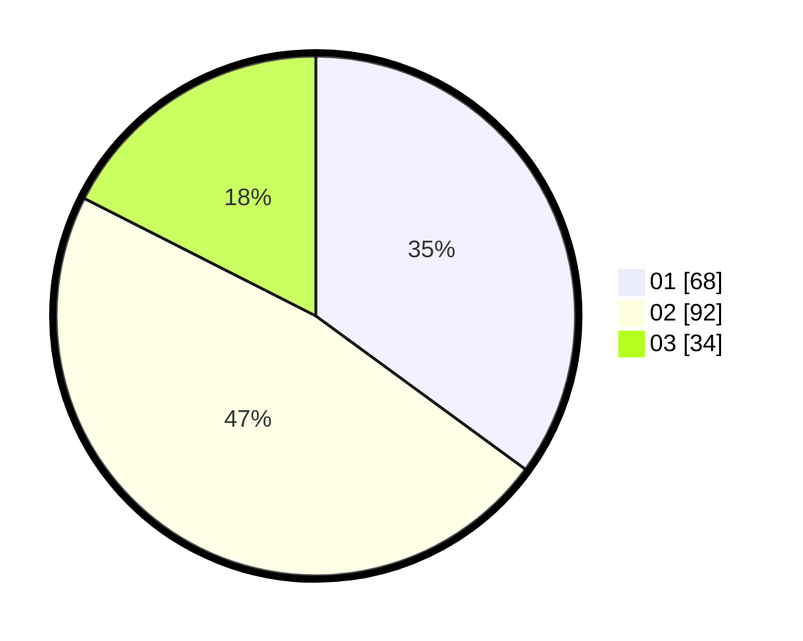

# Hasil

Hasil perolehan suara paslon dapat dilihat pada file paslon-01.txt, paslon-02.txt, dan paslon-03.txt.

Jika tidak ada, artinya data tersebut belum ada pada SIREKAP.

## Perolehan Suara

 * Paslon 01: **68**.
 * Paslon 02: **92**.
 * Paslon 03: **34**.

## Foto C Plano

https://sirekap-obj-formc.kpu.go.id/878a/pemilu/ppwp/31/75/09/10/01/3175091001053-20240214-155136--b4598533-3f90-40bf-86aa-353585b7c180.jpg

https://sirekap-obj-formc.kpu.go.id/878a/pemilu/ppwp/31/75/09/10/01/3175091001053-20240214-155218--9955e46b-984c-4bca-a090-8e6d232d4441.jpg

https://sirekap-obj-formc.kpu.go.id/878a/pemilu/ppwp/31/75/09/10/01/3175091001053-20240216-150413--b3ef61a0-7bd7-4403-82ec-50a83a30a41e.jpg

## DATA PEMILIH TETAP

Jumlah pemilih dalam DPT: **263**.
 * L: **123**.
 * P: **140**.

## DATA PENGGUNA HAK PILIH

Jumlah pengguna hak pilih dalam DPT: **194**.
 * L: **87**.
 * P: **107**.

Jumlah pengguna hak pilih dalam DPTb: **0**.
 * L: **0**.
 * P: **0**.

Jumlah pengguna hak pilih dalam DPK: **4**.
 * L: **1**.
 * P: **3**.

Jumlah pengguna hak pilih: **198**.
 * L: **88**.
 * P: **110**.

## JUMLAH SUARA SAH DAN TIDAK SAH

JUMLAH SELURUH SUARA SAH: **194**.

JUMLAH SUARA TIDAK SAH: **4**.

JUMLAH SELURUH SUARA SAH DAN SUARA TIDAK SAH: **198**.
