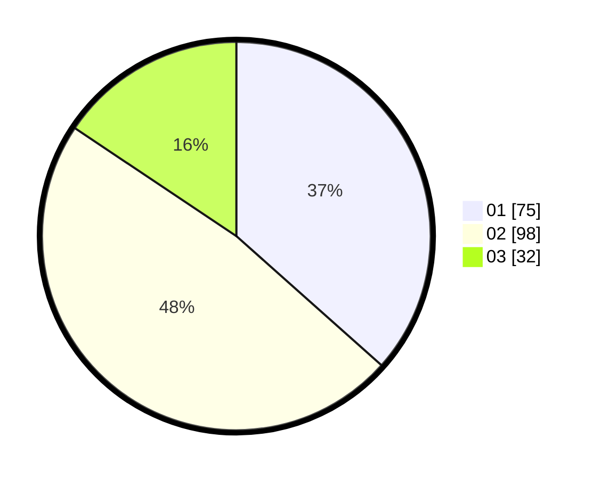

# Hasil

Hasil perolehan suara paslon dapat dilihat pada file paslon-01.txt, paslon-02.txt, dan paslon-03.txt.

Jika tidak ada, artinya data tersebut belum ada pada SIREKAP.

## Perolehan Suara

 * Paslon 01: **75**.
 * Paslon 02: **98**.
 * Paslon 03: **32**.

## Foto C Plano

https://sirekap-obj-formc.kpu.go.id/5eea/pemilu/ppwp/31/75/09/10/01/3175091001065-20240216-065128--e27bb949-4db8-4eb3-8d9a-b9cf5d554ce9.jpg

https://sirekap-obj-formc.kpu.go.id/5eea/pemilu/ppwp/31/75/09/10/01/3175091001065-20240216-114527--72835eb8-f85e-4da5-abfc-41e133c745cd.jpg

https://sirekap-obj-formc.kpu.go.id/5eea/pemilu/ppwp/31/75/09/10/01/3175091001065-20240217-210251--2a983b6b-98e4-4678-9276-f7d0188591d4.jpg
