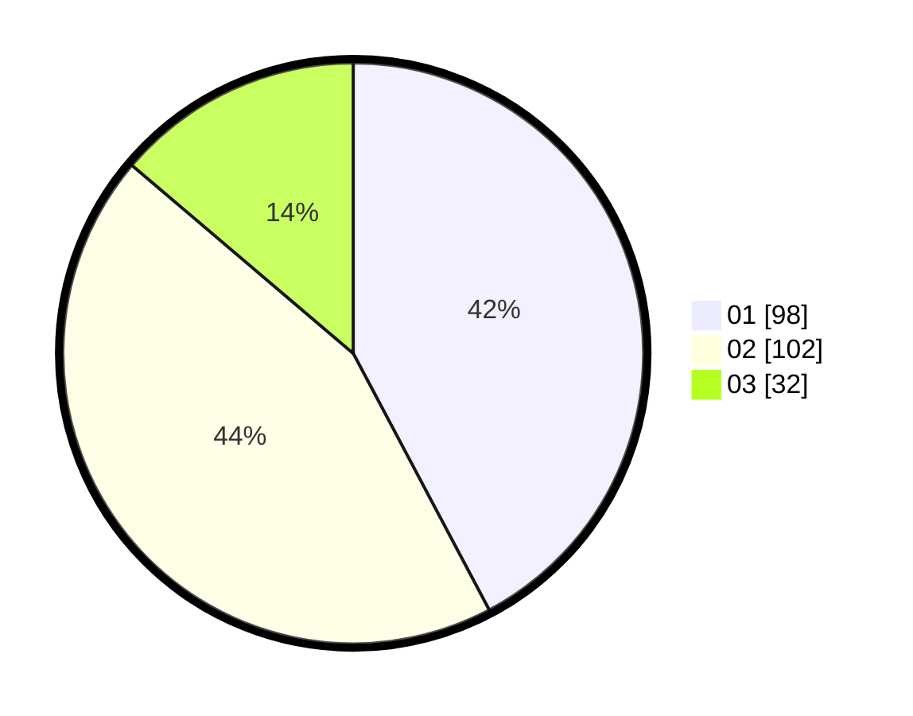

# Hasil

Hasil perolehan suara paslon dapat dilihat pada file paslon-01.txt, paslon-02.txt, dan paslon-03.txt.

Jika tidak ada, artinya data tersebut belum ada pada SIREKAP.

## Perolehan Suara

 * Paslon 01: **98**.
 * Paslon 02: **102**.
 * Paslon 03: **32**.

## Foto C Plano

https://sirekap-obj-formc.kpu.go.id/5a9c/pemilu/ppwp/31/75/09/10/01/3175091001073-20240214-190454--27c52362-2263-49be-ab2d-ebdd46ee3bd5.jpg

https://sirekap-obj-formc.kpu.go.id/5a9c/pemilu/ppwp/31/75/09/10/01/3175091001073-20240214-190507--799f7297-94aa-4bbd-863f-7b2245cb7719.jpg

https://sirekap-obj-formc.kpu.go.id/5a9c/pemilu/ppwp/31/75/09/10/01/3175091001073-20240214-190511--b8c3a8a1-d9fa-4372-8641-940bfa9d3efe.jpg

## DATA PEMILIH TETAP

Jumlah pemilih dalam DPT: **276**.
 * L: **330**.
 * P: **546**.

## DATA PENGGUNA HAK PILIH

Jumlah pengguna hak pilih dalam DPT: **235**.
 * L: **620**.
 * P: **626**.

Jumlah pengguna hak pilih dalam DPTb: **805**.
 * L: **808**.
 * P: **88**.

Jumlah pengguna hak pilih dalam DPK: **808**.
 * L: **800**.
 * P: **88**.

Jumlah pengguna hak pilih: **236**.
 * L: **320**.
 * P: **335**.

## JUMLAH SUARA SAH DAN TIDAK SAH

JUMLAH SELURUH SUARA SAH: **232**.

JUMLAH SUARA TIDAK SAH: **4**.

JUMLAH SELURUH SUARA SAH DAN SUARA TIDAK SAH: **236**.
