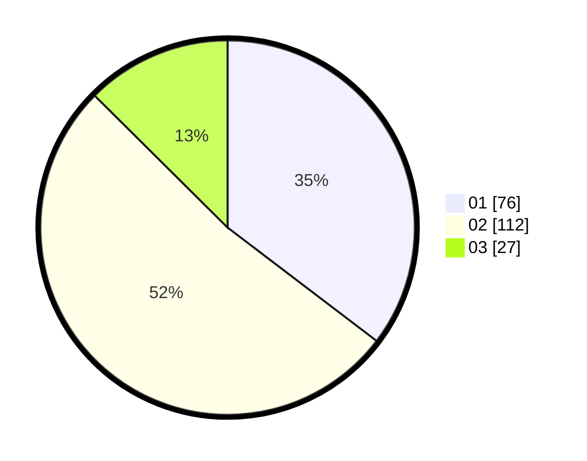

# Hasil

Hasil perolehan suara paslon dapat dilihat pada file paslon-01.txt, paslon-02.txt, dan paslon-03.txt.

Jika tidak ada, artinya data tersebut belum ada pada SIREKAP.

## Perolehan Suara

 * Paslon 01: **76**.
 * Paslon 02: **112**.
 * Paslon 03: **27**.

## Foto C Plano

https://sirekap-obj-formc.kpu.go.id/dba0/pemilu/ppwp/31/75/09/10/01/3175091001074-20240214-224739--90576414-cb18-406b-877a-7bd812a9409f.jpg

https://sirekap-obj-formc.kpu.go.id/dba0/pemilu/ppwp/31/75/09/10/01/3175091001074-20240214-225708--81261488-1337-4d28-8f0b-82a53c634b3d.jpg

https://sirekap-obj-formc.kpu.go.id/dba0/pemilu/ppwp/31/75/09/10/01/3175091001074-20240214-225823--7c1ee876-3a4e-4b56-a22e-852e831b28d5.jpg

## DATA PEMILIH TETAP

Jumlah pemilih dalam DPT: **272**.
 * L: **141**.
 * P: **131**.

## DATA PENGGUNA HAK PILIH

Jumlah pengguna hak pilih dalam DPT: **218**.
 * L: **108**.
 * P: **110**.

Jumlah pengguna hak pilih dalam DPTb: **0**.
 * L: **0**.
 * P: **0**.

Jumlah pengguna hak pilih dalam DPK: **0**.
 * L: **0**.
 * P: **0**.

Jumlah pengguna hak pilih: **218**.
 * L: **108**.
 * P: **110**.

## JUMLAH SUARA SAH DAN TIDAK SAH

JUMLAH SELURUH SUARA SAH: **215**.

JUMLAH SUARA TIDAK SAH: **3**.

JUMLAH SELURUH SUARA SAH DAN SUARA TIDAK SAH: **218**.
