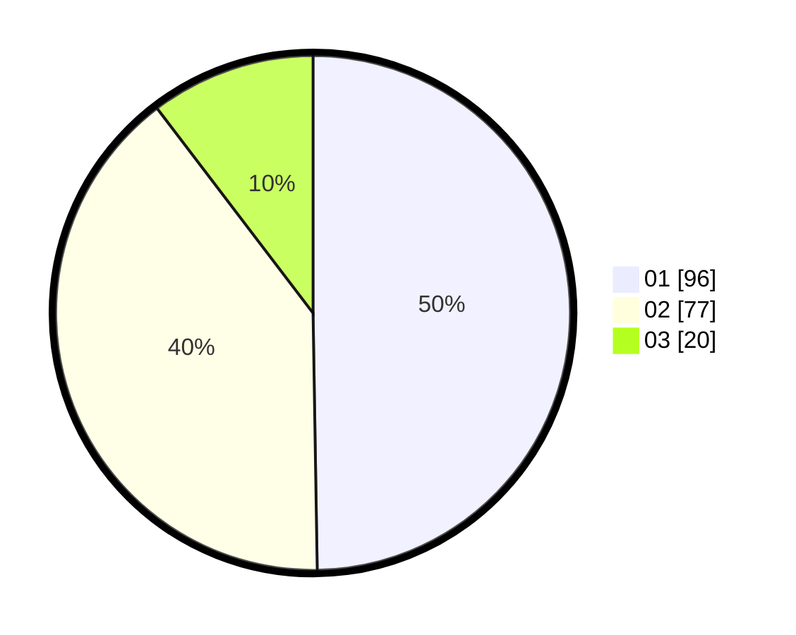

# Hasil

Hasil perolehan suara paslon dapat dilihat pada file paslon-01.txt, paslon-02.txt, dan paslon-03.txt.

Jika tidak ada, artinya data tersebut belum ada pada SIREKAP.

## Perolehan Suara

 * Paslon 01: **96**.
 * Paslon 02: **77**.
 * Paslon 03: **20**.

## Foto C Plano

https://sirekap-obj-formc.kpu.go.id/f41f/pemilu/ppwp/31/75/09/10/01/3175091001075-20240214-185632--d2c28ca3-d196-43c8-a250-219fde9332f7.jpg

https://sirekap-obj-formc.kpu.go.id/f41f/pemilu/ppwp/31/75/09/10/01/3175091001075-20240214-185655--7e360225-ef4c-48ec-8187-23e580ddd39f.jpg

https://sirekap-obj-formc.kpu.go.id/f41f/pemilu/ppwp/31/75/09/10/01/3175091001075-20240214-185713--cc0e4274-55db-4ec8-9204-7a44f5a21fab.jpg

## DATA PEMILIH TETAP

Jumlah pemilih dalam DPT: **266**.
 * L: **130**.
 * P: **136**.

## DATA PENGGUNA HAK PILIH

Jumlah pengguna hak pilih dalam DPT: **194**.
 * L: **93**.
 * P: **101**.

Jumlah pengguna hak pilih dalam DPTb: **0**.
 * L: **0**.
 * P: **0**.

Jumlah pengguna hak pilih dalam DPK: **3**.
 * L: **1**.
 * P: **2**.

Jumlah pengguna hak pilih: **197**.
 * L: **94**.
 * P: **103**.

## JUMLAH SUARA SAH DAN TIDAK SAH

JUMLAH SELURUH SUARA SAH: **193**.

JUMLAH SUARA TIDAK SAH: **4**.

JUMLAH SELURUH SUARA SAH DAN SUARA TIDAK SAH: **197**.
