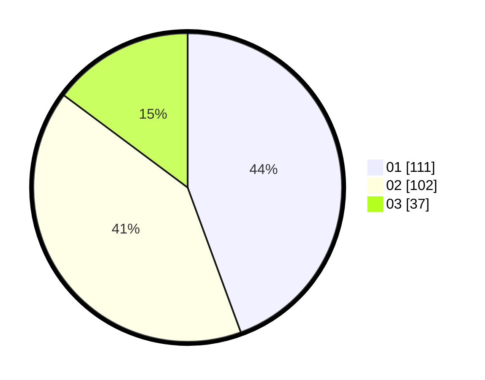

# Hasil

Hasil perolehan suara paslon dapat dilihat pada file paslon-01.txt, paslon-02.txt, dan paslon-03.txt.

Jika tidak ada, artinya data tersebut belum ada pada SIREKAP.

## Perolehan Suara

 * Paslon 01: **111**.
 * Paslon 02: **102**.
 * Paslon 03: **37**.

## Foto C Plano

https://sirekap-obj-formc.kpu.go.id/3ec4/pemilu/ppwp/31/75/09/10/01/3175091001076-20240215-164523--4e967174-a26a-433f-a7d9-380a1b460775.jpg

https://sirekap-obj-formc.kpu.go.id/3ec4/pemilu/ppwp/31/75/09/10/01/3175091001076-20240215-164607--413a2aca-9260-4f79-9fcb-4a09ad6b0c1b.jpg

https://sirekap-obj-formc.kpu.go.id/3ec4/pemilu/ppwp/31/75/09/10/01/3175091001076-20240215-164648--ebb360b2-e1f5-4182-9b55-6f4120595334.jpg
