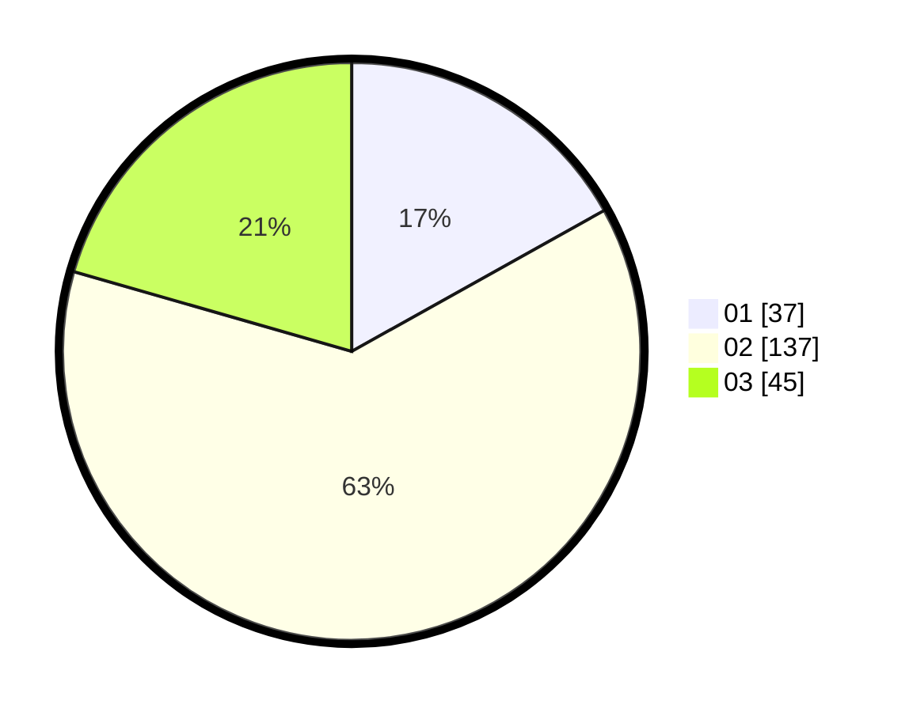

# Hasil

Hasil perolehan suara paslon dapat dilihat pada file paslon-01.txt, paslon-02.txt, dan paslon-03.txt.

Jika tidak ada, artinya data tersebut belum ada pada SIREKAP.

## Perolehan Suara

 * Paslon 01: **37**.
 * Paslon 02: **137**.
 * Paslon 03: **45**.

## Foto C Plano

https://sirekap-obj-formc.kpu.go.id/3043/pemilu/ppwp/31/75/09/10/01/3175091001078-20240214-193737--e462318a-4616-46f7-bf08-ee5a924e811e.jpg

https://sirekap-obj-formc.kpu.go.id/3043/pemilu/ppwp/31/75/09/10/01/3175091001078-20240214-193401--e250205b-463b-422e-9078-e3eaa9335124.jpg

https://sirekap-obj-formc.kpu.go.id/3043/pemilu/ppwp/31/75/09/10/01/3175091001078-20240214-193456--1b39690f-7dd5-452b-ae44-73a36c0526d5.jpg

## DATA PEMILIH TETAP

Jumlah pemilih dalam DPT: **273**.
 * L: **75**.
 * P: **198**.

## DATA PENGGUNA HAK PILIH

Jumlah pengguna hak pilih dalam DPT: **218**.
 * L: **55**.
 * P: **163**.

Jumlah pengguna hak pilih dalam DPTb: **0**.
 * L: **0**.
 * P: **0**.

Jumlah pengguna hak pilih dalam DPK: **3**.
 * L: **1**.
 * P: **2**.

Jumlah pengguna hak pilih: **221**.
 * L: **56**.
 * P: **165**.

## JUMLAH SUARA SAH DAN TIDAK SAH

JUMLAH SELURUH SUARA SAH: **219**.

JUMLAH SUARA TIDAK SAH: **2**.

JUMLAH SELURUH SUARA SAH DAN SUARA TIDAK SAH: **221**.
