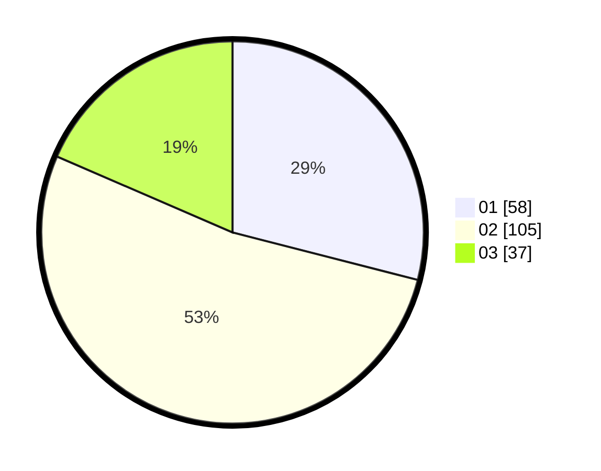

# Hasil

Hasil perolehan suara paslon dapat dilihat pada file paslon-01.txt, paslon-02.txt, dan paslon-03.txt.

Jika tidak ada, artinya data tersebut belum ada pada SIREKAP.

## Perolehan Suara

 * Paslon 01: **58**.
 * Paslon 02: **105**.
 * Paslon 03: **37**.

## Foto C Plano

https://sirekap-obj-formc.kpu.go.id/4c31/pemilu/ppwp/31/75/09/10/01/3175091001082-20240214-215052--380f1136-4559-4718-8f6c-419e88f82f09.jpg

https://sirekap-obj-formc.kpu.go.id/4c31/pemilu/ppwp/31/75/09/10/01/3175091001082-20240214-215122--65219d75-d356-4601-a28a-c1c8f61d7f01.jpg

https://sirekap-obj-formc.kpu.go.id/4c31/pemilu/ppwp/31/75/09/10/01/3175091001082-20240217-010356--7d075aa2-2125-4a8e-a2d1-c1790aeeb393.jpg

## DATA PEMILIH TETAP

Jumlah pemilih dalam DPT: **273**.
 * L: **138**.
 * P: **135**.

## DATA PENGGUNA HAK PILIH

Jumlah pengguna hak pilih dalam DPT: **201**.
 * L: **93**.
 * P: **108**.

Jumlah pengguna hak pilih dalam DPTb: **0**.
 * L: **0**.
 * P: **0**.

Jumlah pengguna hak pilih dalam DPK: **2**.
 * L: **2**.
 * P: **0**.

Jumlah pengguna hak pilih: **203**.
 * L: **95**.
 * P: **108**.

## JUMLAH SUARA SAH DAN TIDAK SAH

JUMLAH SELURUH SUARA SAH: **0**.

JUMLAH SUARA TIDAK SAH: **0**.

JUMLAH SELURUH SUARA SAH DAN SUARA TIDAK SAH: **0**.
