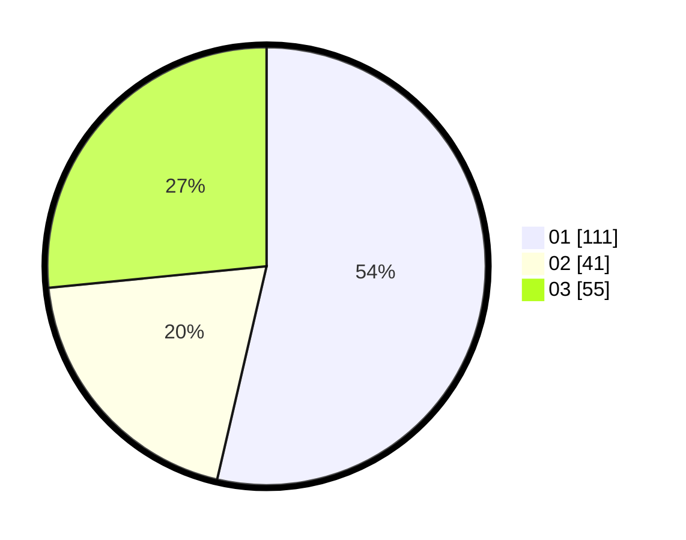

# Hasil

Hasil perolehan suara paslon dapat dilihat pada file paslon-01.txt, paslon-02.txt, dan paslon-03.txt.

Jika tidak ada, artinya data tersebut belum ada pada SIREKAP.

## Perolehan Suara

 * Paslon 01: **111**.
 * Paslon 02: **41**.
 * Paslon 03: **55**.

## Foto C Plano

https://sirekap-obj-formc.kpu.go.id/410b/pemilu/ppwp/31/75/09/10/01/3175091001084-20240215-193809--a875b69d-aab2-419d-b27c-a1451c5c7615.jpg

https://sirekap-obj-formc.kpu.go.id/410b/pemilu/ppwp/31/75/09/10/01/3175091001084-20240217-082159--21f9d010-e0f5-4c49-b6cd-0bcf0725928a.jpg

https://sirekap-obj-formc.kpu.go.id/410b/pemilu/ppwp/31/75/09/10/01/3175091001084-20240214-231444--515b4083-6411-457c-85d3-07a43ddead29.jpg

## DATA PEMILIH TETAP

Jumlah pemilih dalam DPT: **280**.
 * L: **123**.
 * P: **157**.

## DATA PENGGUNA HAK PILIH

Jumlah pengguna hak pilih dalam DPT: **241**.
 * L: **101**.
 * P: **140**.

Jumlah pengguna hak pilih dalam DPTb: **10**.
 * L: **3**.
 * P: **7**.

Jumlah pengguna hak pilih dalam DPK: **8**.
 * L: **4**.
 * P: **4**.

Jumlah pengguna hak pilih: **259**.
 * L: **108**.
 * P: **151**.

## JUMLAH SUARA SAH DAN TIDAK SAH

JUMLAH SELURUH SUARA SAH: **257**.

JUMLAH SUARA TIDAK SAH: **2**.

JUMLAH SELURUH SUARA SAH DAN SUARA TIDAK SAH: **259**.
