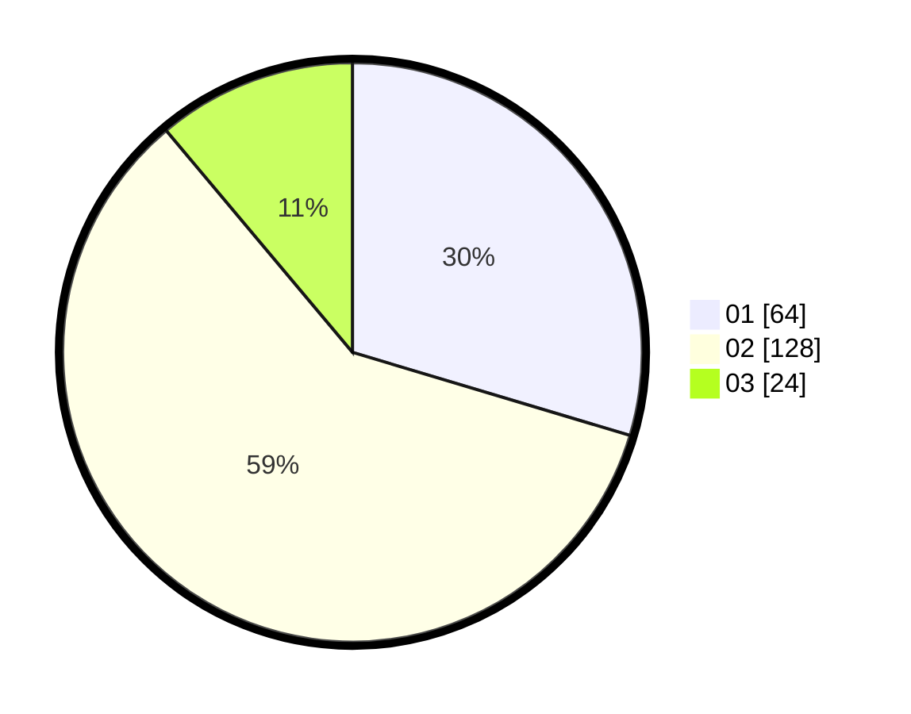

# Hasil

Hasil perolehan suara paslon dapat dilihat pada file paslon-01.txt, paslon-02.txt, dan paslon-03.txt.

Jika tidak ada, artinya data tersebut belum ada pada SIREKAP.

## Perolehan Suara

 * Paslon 01: **64**.
 * Paslon 02: **128**.
 * Paslon 03: **24**.

## Foto C Plano

https://sirekap-obj-formc.kpu.go.id/08d0/pemilu/ppwp/31/75/09/10/01/3175091001085-20240214-193338--044dab19-fb25-436e-b234-af00cf0ff166.jpg

https://sirekap-obj-formc.kpu.go.id/08d0/pemilu/ppwp/31/75/09/10/01/3175091001085-20240214-194010--f65624a3-6aec-41a0-b3bb-4c6d63093e50.jpg

https://sirekap-obj-formc.kpu.go.id/08d0/pemilu/ppwp/31/75/09/10/01/3175091001085-20240214-194030--a5b3b50f-e562-4857-9da8-e5b9cd303e40.jpg

## DATA PEMILIH TETAP

Jumlah pemilih dalam DPT: **268**.
 * L: **131**.
 * P: **137**.

## DATA PENGGUNA HAK PILIH

Jumlah pengguna hak pilih dalam DPT: **216**.
 * L: **97**.
 * P: **119**.

Jumlah pengguna hak pilih dalam DPTb: **0**.
 * L: **0**.
 * P: **0**.

Jumlah pengguna hak pilih dalam DPK: **2**.
 * L: **0**.
 * P: **2**.

Jumlah pengguna hak pilih: **218**.
 * L: **79**.
 * P: **121**.

## JUMLAH SUARA SAH DAN TIDAK SAH

JUMLAH SELURUH SUARA SAH: **216**.

JUMLAH SUARA TIDAK SAH: **2**.

JUMLAH SELURUH SUARA SAH DAN SUARA TIDAK SAH: **218**.
